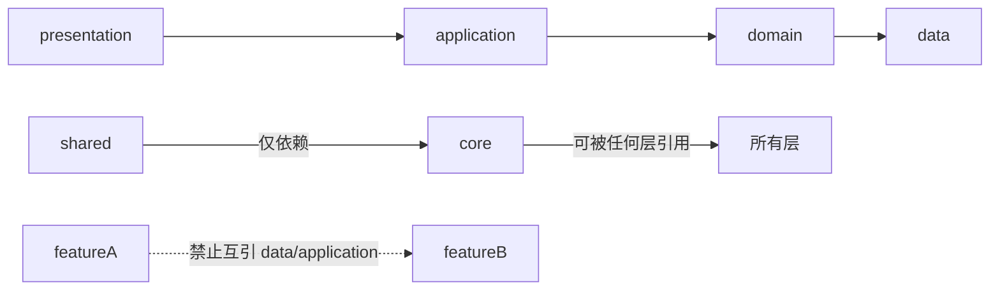

# 02 · 目录结构（Project Structure）

> 高层目录地图 + 目录职责 + 新增位置规范。架构基准 Feature First，权威规则见 [.cursor/rules/flutter-architecture-strict-v2.mdc](../.cursor/rules/flutter-architecture-strict-v2.mdc)。返回 [文档导航](./README.md)。

## 0. 总体架构

采用 **Feature First + 分层解耦**：`lib/` 内部分为 `core`（底座）、`shared`（复用 UI）、`features`（业务）、`routes`（路由），依赖方向严格单向：



依赖硬规则：`core → all`、`shared → core only`、`domain` 纯 Dart、feature 之间只能通过 `core/domain` 模型或 `core/services` 协作。

## 1. 根目录

| 目录/文件 | 作用 | 内容 |
|---|---|---|
| `lib/` | 应用源码 | 见下文 |
| `assets/` | 静态资源 | `covers/fonts/icons/images/lottie/shaders`（见 [09_Assets.md](./09_Assets.md)） |
| `design-system/` | **UI 设计唯一权威** | `README.md`（token+组件规范）、`*.canvas.tsx`（可视化） |
| `docs/` | 研发知识库 | 本套编号文档 + `backend/` 后端草案 + `features/` 页面实现说明 |
| `test/` | 测试 | 目前仅 6 个文件 |
| `scripts/` / `tool/` | 预览部署与辅助脚本 | shell 脚本、`tool/previews` |
| `android/ios/macos/web` | 平台工程 | 原生壳与配置 |
| `build/`、`.dart_tool/` | 自动生成（勿手改） | 构建产物 |
| `pubspec.yaml`、`analysis_options.yaml`、`.metadata` | 工程配置 | 依赖/lint/版本 |

- **设计原因**：源码全部收敛在 `lib/`，资源、文档、脚本、平台工程与源码分离，符合 Flutter 官方模板 + 团队规范。
- **公共能力**：`design-system/`、`docs/`、`scripts/`、`analysis_options.yaml`；根目录不放业务。

## 2. `lib/core/` — 跨 feature 底座

作用：提供所有 feature 共享的基础能力；依赖方向 `core → all`，**禁止 `core → features`**。

| 子目录 | 内容 | 属性 |
|---|---|---|
| `theme/` | 设计 token 真源：`app_palette`→`app_brand_colors`→`app_colors`；`app_spacing/sizes/radius/text_styles/durations/layout`；`app_theme`/`app_theme_context` | 公共（见 [03](./03_Theme.md)/[04](./04_DesignToken.md)） |
| `services/` | 跨 feature 服务：`service_locator`（注册入口）、`auth_service`(+mock/rest+`auth_service_config`)、`auth_session_service`、`membership_status_service`、`bookshelf_membership_service`、`onboarding_service`、`image_picker_service`、`social_app_launch_service` | 公共 |
| `network/` | `api_client`（`HttpApiClient`）、`api_config`、`api_exception` | 公共 |
| `domain/entities/` | 跨 feature 共享领域模型：`book`、`auth_user`、`auth_session`、`member_account`、`commerce_entities`、`user_basic_info` 等（纯 Dart） | 公共 |
| `constants/` | `app_constants`、`main_tab_config`、`currency_config`、`bookshelf_tab_intent`、`currency_mock_data` | 公共 |

- **设计原因**：token 单一真源，改一处全局生效；服务集中定位便于后续替换真实实现；共享模型放 `core/domain` 是 feature 间协作的唯一合法通道。
- **可优化**：`service_locator` 手写单例，服务变多后建议迁 `get_it`/`riverpod`；`constants/currency_mock_data.dart` 是 mock 数据，语义上更适合下沉 `currency_wallet` 的 data 层。

## 3. `lib/shared/` — 复用 UI

作用：跨 feature 复用的 UI；依赖方向 `shared → core only`，**禁止写业务逻辑**。三级分层（组件清单见 [05_Components.md](./05_Components.md)）：

| 子目录 | 层级 | 内容 |
|---|---|---|
| `widgets/` | L1 原子 | `app_text`、`app_button`、`app_icon`、`app_switch`、`book_cover`、`app_pressable`、`aurora_background` 等 |
| `components/` | L2 组合 | `empty_state`、`app_top_bar`、`section_header`、`book_card_variants`、`elastic_tab_indicator`、`app_swipe_tab_switcher`、`app_blurred_dialog` 等 |
| `layouts/` | 页面骨架 | `app_scaffold`、`app_page_chrome`、`app_bottom_nav`、`main_tab_shell`、`app_scroll_blur_scope` 等 |

- **进入门槛**：≥3 处复用且无业务逻辑；反之保留在 feature（防 shared 污染）。
- **可优化**：`components/` 已 50+ 文件偏扁平，建议按域再分子目录；警惕偏业务组件（`energy_recharge_purchase_dialog`、`recharge_packages_section*`、`vip_promo_banner`）下沉回 feature。

## 4. `lib/features/<name>/` — 业务模块（23 个）

每个 feature 统一四层结构（以 `book_detail` 为例已验证）：

```
features/book_detail/
  data/         # datasources(*_data_source 抽象 + *_mock/*_remote) + repositories 实现
  domain/       # entities + repositories 抽象接口（纯 Dart）
  application/  # cubit + state（拆 ui_state / domain_state / interaction_state）
  presentation/ # pages + components
  index.dart    # 对外统一导出
```

- **作用**：每个业务域自包含四层，内部高内聚、对外通过 `index.dart` 暴露最小面。
- **规范性**：结构一致、契约清晰，是本项目最规范的部分。
- **可优化**：真实数据源仅 `bookstore`/`search` 有 `*_remote_datasource`；`help_feedback` 无独立 repository 抽象，建议补齐统一。

## 5. `lib/routes/` — 路由层

| 文件 | 作用 |
|---|---|
| `app_router.dart` | `go_router` 组合与统一跳转入口（`AppRouter.go/pushNamed/goBookDetail`） |
| `app_routes.dart` | 路由名/路径常量 |
| `route_extras.dart` | 路由传参模型 |
| `groups/` | 按域拆分：`root`/`discovery`/`book_detail`/`membership_wallet`/`account_settings` |
| `pages/main_tab_shell_page.dart` | 一级 Tab 壳（挂载各 Tab cubit 的组合根） |

## 6. `lib/` 入口与预览

| 文件/目录 | 作用 | 属性 |
|---|---|---|
| `main.dart` | 正式入口（`ServiceLocator.init` → `runApp`） | 公共 |
| `app.dart` | 根组件（`MaterialApp.router`） | 公共 |
| `previews/` | 开发/CI 预览入口：`global_preview_main` 等 | 公共（仅调试/部署，不写业务） |

## 7. 新增位置规范

- **新增页面（已有 feature）**：`features/<name>/presentation/pages/`，拆分组件进同级 `components/`，`index.dart` 导出。
- **新增业务域**：新建 `features/<new>/{data,domain,application,presentation,index.dart}`。
- **新增复用 UI（≥3 处、无业务）**：`shared/widgets`(L1) / `shared/components`(L2)。
- **新增路由**：`routes/groups/<域>_routes.dart` 注册，常量入 `app_routes.dart`；跳转走 `AppRouter`。
- 详细「新增各类元素放哪里」见 [11_DevelopmentGuide.md](./11_DevelopmentGuide.md)。

## 8. 整体规范性评估

| 维度 | 评价 |
|---|---|
| 分层清晰度 | 达标：core/shared/features/routes 边界明确，依赖单向 |
| 设计系统 | 优秀：唯一 token 真源 + 可视化 canvas |
| feature 一致性 | 达标：23 个 feature 结构统一 |
| 契约与解耦 | 达标：domain 抽象 + data 实现，接口先行 |
| 测试 | 偏弱：仅 6 个测试，覆盖率低 |
| 依赖注入 | 偏弱：手写 `ServiceLocator`，规模化后建议升级 |

**结论**：目录结构达到大型 Flutter 工程规范水平，是本项目的强项。
