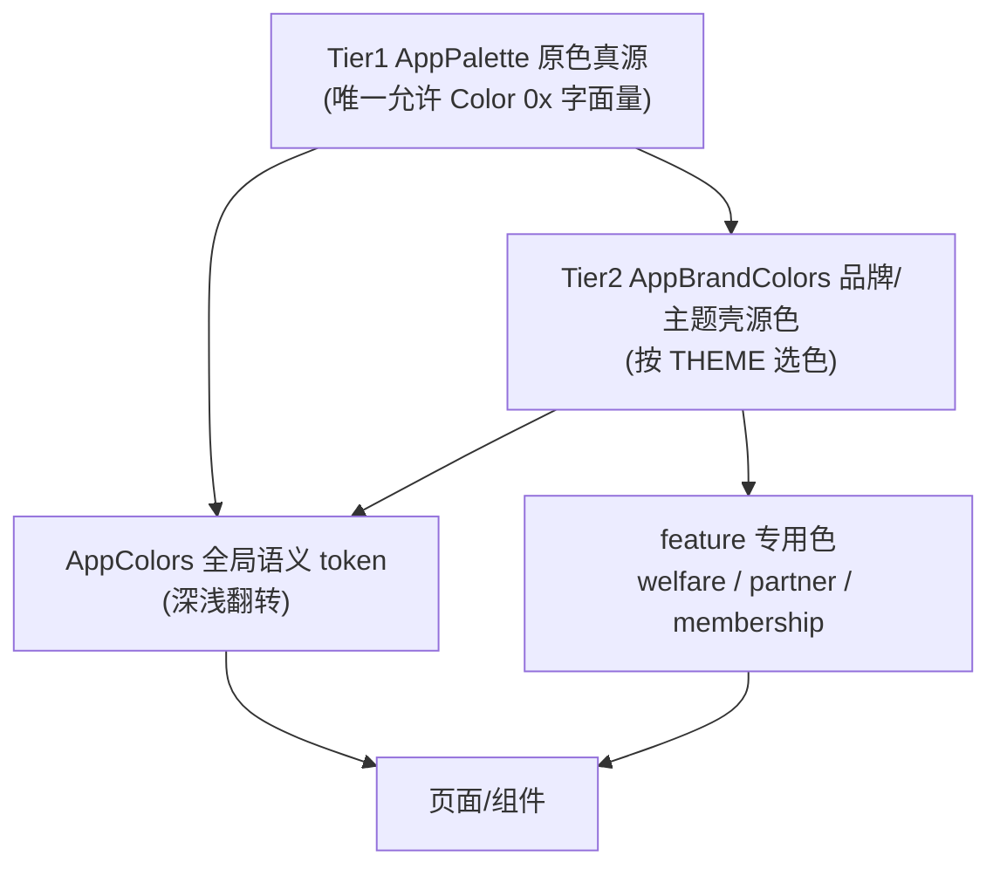

# 03 · 主题系统（Theme）

> Token 真源全部位于 [lib/core/theme/](../lib/core/theme/)。核心原则：**改 token 一处，全局生效**；页面只引用语义名，禁止写死样式。设计权威见 [design-system/README.md](../design-system/README.md)。Token 三层分层详见 [04_DesignToken.md](./04_DesignToken.md)。返回 [文档导航](./README.md)。

## 1. 颜色系统

采用**三层 Token 架构**（原色 → 品牌/主题 → 全局语义），页面只接触最上层语义名：

| 层级 | 文件 | 职责 |
|---|---|---|
| Tier 1 原色 | [app_palette.dart](../lib/core/theme/app_palette.dart) | **全项目唯一**允许 `Color(0x…)` 字面量；只放无语义原色 |
| Tier 2 品牌/主题 | [app_brand_colors.dart](../lib/core/theme/app_brand_colors.dart) | 按 `themeId`（`--dart-define=THEME`）选原色 + feature 品牌语义 |
| 语义层 | [app_colors.dart](../lib/core/theme/app_colors.dart) | 全局语义 token（`primary`/`surface`/`textPrimary`…）+ 深浅主题翻转 |
| feature 色板 | `app_welfare_colors.dart`、`app_partner_colors.dart`、`app_membership_colors.dart` | 业务专用色 |
| 主题装配 | [app_theme.dart](../lib/core/theme/app_theme.dart)、`app_color_scheme.dart` | `ThemeData` / `ColorScheme` 组装 |

- **主题切换**：编译期实验包机制，`--dart-define=THEME=<id>`（默认 `yellow_dark`）。当前三包：`yellow_dark`（默认深色）、`pink_light`（粉色浅色系）、`yellow_light`（黄色浅色系：壳背景 `neutralCool50` #F8F7FC 中性浅灰，主强调色换黄 `#FFE847`）。
- **两类分支**：§A 拆为「中性外壳」（`backgroundDark`/`bgTint*`：`pink_light`→`pink50`、`yellow_light`→`neutralCool50`；浮层/壳文字两浅色包仍共用）与「强调身份」（`accent`/`onAccent`/`accentSoft*`/`accentDisabledFill`，按 `themeId==pink_light` 判定粉 vs 黄，`yellow_dark` 与 `yellow_light` 同走黄）。主色上文字/图标一律走 `onPrimary`（`onAccent`）：黄底深墨、粉底白字。
- **主题资源**：[`AppThemeAssets`](../lib/core/theme/app_theme_assets.dart) 与颜色层平行，按 `THEME` 解析底栏图标 / 书详加入书架·送心 / 底栏纹理 / 一级 Tab 顶纹理（`tabTopTexture`，切图未到位时 null）等路径；详见 [09_Assets.md](./09_Assets.md)。
- **福利页头部渐变**（用户指定，仅 `yellow_light`）：福利页的 `AppTabTopTexture` 在 `tabTopTexture` 为 null 时铺顶部主黄（`primary`）→ 底部白 0%（`white00`）垂直渐隐；书城首页 / 书架不调用该装饰，`yellow_dark` / `pink_light` 起止均透明。
- **浅色 Chrome**：`pink_light` / `yellow_light` 的顶部栏与底部栏在背景启用时统一使用 `white100` 100% 实底，并跳过 `BackdropFilter`；`yellow_dark` 保持原毛玻璃。福利页未滚动重叠时仍透出浅黄彩头，吸顶后切白色实底。
- **约束**：默认恒为 `yellow_dark`，§A 的 yellow_dark 分支（`AppPalette` 深色原色）不得改动。

## 2. 字体系统

真源 [app_text_styles.dart](../lib/core/theme/app_text_styles.dart)，拆为 4 组基元 + 样式集：

| Token 类 | 内容 |
|---|---|
| `AppFontFamilies` | `number = 'TCloudNumber'`（定制数字字体，仅 ≥18px 引用，中文/字母回退系统字体） |
| `AppFontSizes` | 字号阶梯：`xxs9 / xs10 / md12 / base14 / lg16 / xl18 / xxl24 / display32` |
| `AppLineHeights` | 行高：`none1.0 / tight1.2 / normal1.4 / loose1.75` |
| `AppFontWeights` | 字重：`regular400 → black900` |
| `AppTextStyles` | 组合样式：`displayLarge / headlineMedium / titleMedium / bodyLarge / bodyMedium …`（约 1285 行，全站文字样式集合） |

## 3. 间距系统

双 token 源，职责不同：

| 文件 | 用途 |
|---|---|
| [app_spacing.dart](../lib/core/theme/app_spacing.dart) | 通用间距阶梯：`xxsHalf2 / xxs4 / xs8 / sm12 / md16 / lg24 / xl32 / xxl48` |
| [app_sizes.dart](../lib/core/theme/app_sizes.dart) | 组件级 Figma 精确尺寸/内边距真源（按 feature 分组，约 760 行） |
| [app_layout.dart](../lib/core/theme/app_layout.dart) | 布局辅助（状态栏高度 `statusBarHeight(context)` 等） |

## 4. 圆角系统

真源 [app_radius.dart](../lib/core/theme/app_radius.dart)：

- 基础档：`xs4 / md12 / lg16 / xl24 / full999`
- 语义别名指向基础档（如 `bookCover = xs`、`welfareCheckInSection = lg`、`membershipCta = xl`），也有少量 Figma 精确值（`searchBar35`、`navOuter47` 等）。
- 页面禁止写 `BorderRadius.circular(数字)`，一律引用 `AppRadius.*`。

## 5. 阴影系统

**本项目没有独立阴影 token 文件，设计语言是「扁平 + 毛玻璃」而非投影驱动**：

- `ThemeData` 中 `AppBar` / `Card` / `Dialog` 的 `elevation` 全为 `0`。
- 全库仅 1 处 `BoxShadow`（[continue_reading_card.dart](../lib/features/bookstore/presentation/components/continue_reading_card.dart) 的悬浮封面），且已完全 token 化（`AppColors.black40` + `AppSizes.continueReadingCoverShadowBlur` + `AppSpacing.xxs`）。
- 层次感主要靠**毛玻璃模糊**表达：`AppSizes` 内的 `*BlurSigma` 系列（`glassBlurSigma4`、`chromeBarBlurSigma40`、`strongBlurSigma90` 等）+ `bgTintXX` 半透明底色。
- **建议**：若后续引入投影，新增 `app_shadows.dart` 统一收口，避免散落。

## 6. 动画时长

真源 [app_durations.dart](../lib/core/theme/app_durations.dart)：`fast150 / normal300 / slow500` + 语义时长（`containerTransform`、`membershipCtaBreath/Sweep`、`tapPressDown/Rebound`、`shimmerSweep`、`numberRoll` 等）。动画组件清单见 [10_Animation.md](./10_Animation.md)。

## 7. Token 化程度自检

全仓 `lib/features/` 扫描：`Color(0x…)` 命中 0、`fontSize: 数字` 命中 0、`BorderRadius.circular(数字)` 命中 0。业务层零硬编码，均走 token。Magic Number 集中在被规则豁免的 token registry（`app_sizes.dart`/`app_text_styles.dart`），多带 Figma 出处或由其它 token 推导。

## 8. 哪些地方不能直接修改

- `AppPalette` 的**深色（yellow_dark）原色**：主题实验默认基线，规则明令不得改动。
- **不得在页面/组件内写死字面量**（`Color(0x…)`、`fontSize:`、`EdgeInsets.all(数字)`、`BorderRadius.circular(数字)`）——必须回 token 真源改。
- **不得绕过语义层直接引用 `AppPalette`**（页面只用 `AppColors` / `AppBrandColors` 语义名）。
- **三处一致**：改任何 token/组件外观，需同步 `design-system/README.md` + `design-system-spec.canvas.tsx` + Cursor 托管副本（规则 §0.1）。

## 9. 修改主题应改哪些文件

| 想改什么 | 改这里 |
|---|---|
| 新增/调整原色 | [app_palette.dart](../lib/core/theme/app_palette.dart)（并登记 design-system §4） |
| 品牌色 / 新增主题实验包 | [app_brand_colors.dart](../lib/core/theme/app_brand_colors.dart)（§A 三元加分支） |
| 全局语义色 / 深浅翻转 | [app_colors.dart](../lib/core/theme/app_colors.dart) |
| 业务专用色 | `app_welfare_colors.dart` / `app_partner_colors.dart` / `app_membership_colors.dart` |
| 字号 / 行高 / 字重 / 文字样式 | [app_text_styles.dart](../lib/core/theme/app_text_styles.dart) |
| 圆角 | [app_radius.dart](../lib/core/theme/app_radius.dart) |
| 通用间距 | [app_spacing.dart](../lib/core/theme/app_spacing.dart) |
| 组件精确尺寸 / 内边距 / 模糊半径 | [app_sizes.dart](../lib/core/theme/app_sizes.dart) |
| 动画时长 | [app_durations.dart](../lib/core/theme/app_durations.dart) |
| `ThemeData` / `ColorScheme` 装配 | [app_theme.dart](../lib/core/theme/app_theme.dart)、`app_color_scheme.dart` |

> 改任一 token 后：全局自动生效，无需改页面；随后按规则执行 `flutter-post-edit-audit` 审计并同步 `design-system/`。切换主题预览：`flutter run --dart-define=THEME=pink_light`（或 `yellow_light`）。
