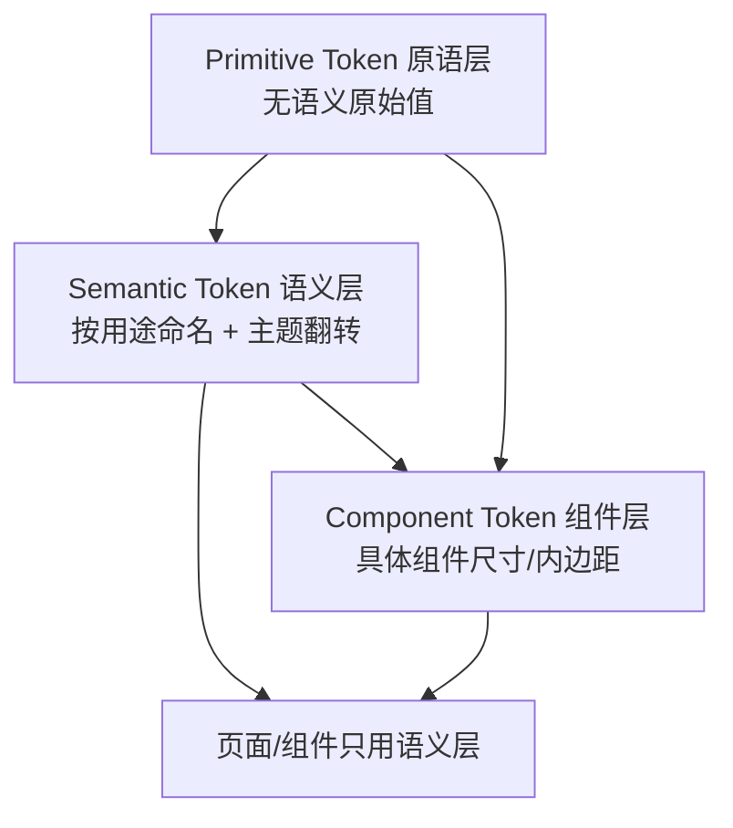

# 04 · 设计 Token（Design Token）

> 本篇按 **Primitive / Semantic / Component** 三层拆解设计 token 体系与使用规范。主题系统概览见 [03_Theme.md](./03_Theme.md)，UI 最高权威见 [design-system/README.md](../design-system/README.md)。返回 [文档导航](./README.md)。

## Token 分层模型

原则：**页面只消费 Semantic / Component token，不碰 Primitive**；改值改在对应层的真源文件，全局自动生效。

## 1. Primitive Token（原语层）

无语义的原始值，是所有上层 token 的唯一来源。

| 类别 | 真源 | 内容 |
|---|---|---|
| 颜色原色 | [app_palette.dart](../lib/core/theme/app_palette.dart) | **全项目唯一**允许 `Color(0x…)`；白/黑透明度阶（`whiteAlpha*`/`blackAlpha*`）、中性色阶（`neutralCool*`）、彩色原色（`pink*`/`orange*`/`yellow500` + `yellow500Alpha04/08/40`…）、主题基色 alpha 阶 |
| 字号原语 | `AppFontSizes`（[app_text_styles.dart](../lib/core/theme/app_text_styles.dart)） | `xxs9 / xs10 / md12 / base14 / lg16 / xl18 / xxl24 / display32` |
| 行高原语 | `AppLineHeights` | `none1.0 / tight1.2 / normal1.4 / loose1.75` |
| 字重原语 | `AppFontWeights` | `regular400 / medium500 / semibold600 / bold700 / heavy800 / black900` |
| 字体族 | `AppFontFamilies` | `number = 'TCloudNumber'` |
| 间距原语 | [app_spacing.dart](../lib/core/theme/app_spacing.dart) | `xxsHalf2 / xxs4 / xs8 / sm12 / md16 / lg24 / xl32 / xxl48` |
| 圆角原语 | [app_radius.dart](../lib/core/theme/app_radius.dart) | `xs4 / md12 / lg16 / xl24 / full999` |
| 时长原语 | [app_durations.dart](../lib/core/theme/app_durations.dart) | `fast150 / normal300 / slow500` |

约束：Primitive 只被 Semantic / Component 层引用，**页面与组件禁止直接引用 `AppPalette`**。

## 2. Semantic Token（语义层）

按用途命名，承载主题选择与深浅翻转；页面主要消费这一层。

| 类别 | 真源 | 示例 |
|---|---|---|
| 主题壳源色 | [app_brand_colors.dart](../lib/core/theme/app_brand_colors.dart) | 中性外壳 `backgroundDark`、`dialogBackground`、`bgTint*`（按 `isLightExperiment` 翻转）+ 强调身份 `accent`、`onAccent`、`accentSoft04/08`、`accentDisabledFill`（按 `themeId` 选粉/黄） |
| 全局语义色 | [app_colors.dart](../lib/core/theme/app_colors.dart) | `primary`、`onPrimary`、`surface`、`textPrimary/Secondary/Tertiary`、`border`、`divider`、`success/warning/error`、`overlayScrim80` |
| feature 语义色 | `app_welfare_colors` / `app_partner_colors` / `app_membership_colors` | 业务专属语义色 |
| 文字样式 | `AppTextStyles`（[app_text_styles.dart](../lib/core/theme/app_text_styles.dart)） | `displayLarge`、`headlineMedium`、`titleMedium`、`bodyLarge`、`bodyMedium`、`caption*` 等组合样式 |
| 圆角语义别名 | [app_radius.dart](../lib/core/theme/app_radius.dart) | `bookCover = xs`、`welfareCheckInSection = lg`、`membershipCta = xl` |
| 语义时长 | [app_durations.dart](../lib/core/theme/app_durations.dart) | `containerTransform`、`shimmerSweep`、`numberRoll`、`tapPressDown/Rebound` |

深浅翻转：`AppColors` 内 `_isLight` 三元根据主题实验包切换中性语义色取值，语义名恒定、调用点零改动。**强调身份色**（`primary`/`onPrimary`/`primarySoft`/`segmentedSelectedFill`/`buttonDisabledFill`）不看 `_isLight`，改为引用 `AppBrandColors` 的强调身份源色跟随强调色（粉 vs 黄）——避免 `yellow_light` 亮黄底上白字不可读。当前三个编译期实验包：`dark`（默认深色）、`pink_light`（粉色浅色系）、`yellow_light`（黄色浅色系：复用 pink_light 中性外壳，主色换黄、卡片细描边改中性浅灰）。

## 3. Component Token（组件层）

具体组件的 Figma 精确尺寸 / 内边距 / 模糊半径 / 比例，集中在 [app_sizes.dart](../lib/core/theme/app_sizes.dart)（约 760 行，按 feature 分组），以及部分圆角 Figma 精确值。

示例：`topBarHeight44`、`bottomNavCapsuleWidth327`、`bookCoverGridAspectRatio`、`glassBlurSigma4`、`chromeBarBlurSigma40`、`strongBlurSigma90`、`welfareCheckInMilestoneHeight70`、`membershipHeroHeight300`、`tapPressScale0.94` 等；部分由其它 token 推导（如 `rankingSegmentedHeight = outerPadding*2 + itemPaddingV*2 + 14`）。

`app_sizes.dart` / `app_text_styles.dart` 作为 token registry，经架构规则 §11 明确豁免「>300 行拆分」。

## 4. 使用规范

- **只用语义/组件 token**：页面与组件禁止 `Color(0x…)`、`fontSize:数字`、`EdgeInsets.all(数字)`、`BorderRadius.circular(数字)`、裸 `Duration(...)`；一律引用 `AppColors`/`AppTextStyles`/`AppSpacing`/`AppSizes`/`AppRadius`/`AppDurations`。
- **改值改真源**：调整视觉改对应层文件一处，全局生效，无需改调用点。
- **新增即征询**：新 token / 新档位 / 新色系须**先停下征询**，落地后同步 `design-system/`（README + canvas 源 + 托管副本三处一致，跑 `scripts/sync-canvas.sh`）；收敛去重（把重复字面量指向已有 token、值不变）可直接做。
- **禁止绕层**：不得跳过 Semantic 直接用 Primitive。

## 5. 现状与建议

- **Token 化程度高**：features 层颜色/字号/圆角零硬编码（实测命中 0）。
- **缺口**：无独立阴影 token（当前扁平 + 毛玻璃）；如后续引入投影建议新增 `app_shadows.dart` 收口。
