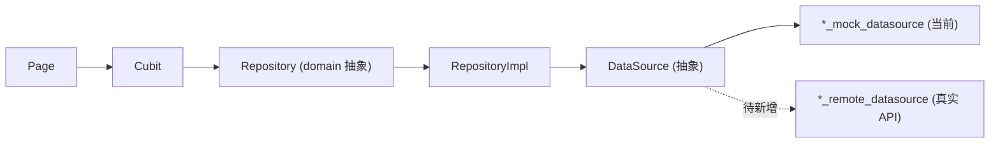

# 06 · 页面架构（Pages）

> 范围：`lib/features/*/presentation/pages/` 全部页面（约 36 个）。每页含：① 页面职责 ② 包含模块（feature 自有 components）③ 使用的公共组件（shared）④ 使用的 Model（domain entities）⑤ 使用的 Repository ⑥ 后续接口接入点。UI→数据链路统一为 `Page → Cubit → Repository(抽象) → RepositoryImpl → DataSource(抽象) → Mock/Remote`。组件详情见 [05_Components.md](./05_Components.md)，数据流见 [07_DataFlow.md](./07_DataFlow.md)。返回 [文档导航](./README.md)。

## 页面-数据总链路

**接入通则**：为目标 feature 新增 `*_remote_datasource.dart` 实现既有 `*_data_source.dart` 抽象，然后在 Cubit 构造或路由/ServiceLocator 注入处把 Mock 换成 Remote，`RepositoryImpl` / domain / UI 均不改。**当前全仓仅 `bookstore`、`search` 已有 Remote 实现（且默认仍注入 Mock）；`auth` 经 `RestAuthService` 已可切真实。**

## 1. 发现 / 内容域

### bookstore · [bookstore_page.dart](../lib/features/bookstore/presentation/pages/bookstore_page.dart)
- **职责**：书城主 Tab 容器（推荐/分类/排行），顶栏切换 + 底部「继续阅读」浮层（全主题锁定深色壳 `continueReadingCard*`，不随浅色包翻转）。
- **模块**：`bookstore_page_header`、`bookstore_recommend_body`、`continue_reading_card`、`ranking_section`、`limited_free_section`、`editor_pick_section`、`guess_like_section`（分类/排行 Tab 由 `CategoryTabBody`、`RankingTabBody` 注入）。
- **公共组件**：`AppPageChrome`、`AppTabTopTexture`、`MainTabController`、`AppAsyncPageBody`、`AppTopBar`、`AppTopBarIconButton`、`AppTopTabBar`、`AppSwipeTabSwitcher`、`BookGridCard`、`SectionHeader`、`BookCoverTagBadge`、`RankingRankBadge`、`BookCover`、`AppMarqueeText`。
- **Model**：`BookstorePageContent`、`BookstoreTopTab`、`Book`、`RankingTab`。
- **Repository**：`BookstoreRepository`。
- **接入点**：`bookstore_cubit.dart` → `BookstoreRepositoryImpl` → `bookstore_data_source.dart`；**Remote 已有** `bookstore_remote_datasource.dart`（`GET /bookstore/home`），默认仍注 Mock，切换注入即可。`loadMoreGuessLike()` 目前本地生成，待补分页接口。

### category · [category_page.dart](../lib/features/category/presentation/pages/category_page.dart)
- **职责**：分类二级页壳（也内嵌于书城 Tab），主体为 `CategoryTabBody`。
- **模块**：`category_tab_body`、`category_filter_section`、`category_book_list`（`category_book_row`）、`category_list_footer`、`category_filter_chip`。
- **公共组件**：`AppPageChrome`、`AppTopBar`、`BookLargeRowListSkeleton`、`EmptyState`、`BookCardLargeRow`、`AppListLoadMoreFooter`。
- **Model**：`CategoryPageContent`、`CategoryFilterGroup`、`CategoryBookItem`、`Book`。
- **Repository**：`CategoryRepository`。
- **接入点**：`category_cubit.dart` → `CategoryRepositoryImpl` → `category_data_source.dart`（仅 Mock）。筛选刷新与 `loadMore()` 当前本地模拟，接入时补分页/筛选接口。

### ranking · [ranking_page.dart](../lib/features/ranking/presentation/pages/ranking_page.dart)
- **职责**：多维度榜单详情页壳（也内嵌书城 Tab），主体为 `RankingTabBody`。
- **模块**：`ranking_tab_body`、`ranking_top_chrome`、`ranking_channel_segmented`、`ranking_dimension_rail`、`ranking_book_row`。
- **公共组件**：`AppScrollBlurScope`、`AppBlurredChromeBar`、`AppTopBarIconButton`、`AppSegmentedSwitch`、`AppVerticalRailSwitch`、`BookCardLargeRow`、`BookLargeRowListSkeleton`、`RankingRankBadge`、`EmptyState`。
- **Model**：`RankingPageContent`、`RankingDimension`、`RankingChannel`、`Book`。
- **Repository**：`RankingRepository`（含 `fetchMoreBooks()`）。
- **接入点**：`ranking_cubit.dart` → `RankingRepositoryImpl` → `ranking_data_source.dart`（仅 Mock）。`fetchMoreBooks()` 已定义未接入分页。

### editor_pick · [editor_pick_page.dart](../lib/features/editor_pick/presentation/pages/editor_pick_page.dart)
- **职责**：编辑推荐 / 限免书单详情页，支持上拉加载。
- **模块**：`editor_pick_book_list`（`editor_pick_book_row`）、`editor_pick_list_footer`。
- **公共组件**：`AppPageChrome`、`AppTopBar`、`EmptyState`、`BookCardLargeRow`、`AppListLoadMoreFooter`。
- **Model**：`EditorPickPageContent`、`EditorPickBookItem`、`Book`。
- **Repository**：`EditorPickRepository`。
- **接入点**：`editor_pick_cubit.dart` → `EditorPickRepositoryImpl` → `editor_pick_data_source.dart`（仅 Mock）。`loadMore()` 本地生成，待接分页。

### home · [home_page.dart](../lib/features/home/presentation/pages/home_page.dart) / [home_shell_page.dart](../lib/features/home/presentation/pages/home_shell_page.dart)
- **职责**：首页基础信息（应用名 + 标语）与加载/错误/空态；Shell 页负责注入 `HomeCubit`。
- **模块**：`home_header`。
- **公共组件**：`AppScaffold`、`AppAsyncPageBody`、`AppText`。
- **Model**：`HomeInfo`。
- **Repository**：`HomeRepository`。
- **接入点**：`home_cubit.dart` → `HomeRepositoryImpl` → `home_data_source.dart`；当前 `home_local_datasource.dart`，无 Remote。

## 2. 阅读 / 社区域

### book_detail · [book_detail_page.dart](../lib/features/book_detail/presentation/pages/book_detail_page.dart)
- **职责**：书籍详情（封面 Hero、摘要、详情/讨论/更新 Tab、目录、底部操作）。
- **模块**：`book_detail_hero_cover`、`book_detail_top_bar`、`book_detail_content`、`book_detail_summary_card`、`book_detail_tab_switcher`、`book_detail_intro`、`book_detail_catalog_entry`/`catalog_drawer`、`book_detail_character_section`、`book_detail_discussion_section`、`book_detail_update_section`、`book_detail_recommendation_section`、`book_detail_promo_bar`、`book_detail_bottom_bar`、`book_detail_status_views`。
- **公共组件**：`AppScrollBlurScope`、`AppBlurredChromeBar`、`AppTopBar`、`OverscrollStretch`、`BookCoverHero`、`AppSwipeTabSwitcher`、`AppSegmentedSwitch`、`AppTabCountBadge`、`BookGridCard`、`SectionHeader`、`ShareBottomSheet`、`AppBlurredDialog`、`DialogCloseButton`、`SweepHighlightOverlay`、`LiquidSweepCtaClip`、`AppToast`、`EmptyState`。
- **Model**：`BookDetail`、`BookDetailTab`、`BookDiscussionFilter`、`BookDiscussionPost`、`BookCatalogChapter`、`BookCharacter`、`BookUpdateEntry`、`Book`。
- **Repository**：`BookDetailRepository`（+加/删书架走 `BookshelfMembershipService`）。
- **接入点**：`book_detail_cubit.dart` → `BookDetailRepositoryImpl` → `book_detail_data_source.dart`（仅 Mock，需新增 remote）。仅 `fetchDetail` 走 repository；讨论点赞/送心/推荐换一换为本地乐观更新。

### book_detail · [book_discussion_detail_page.dart](../lib/features/book_detail/presentation/pages/book_discussion_detail_page.dart)
- **职责**：单条书评主贴 + 全部回复，支持点赞与底部回复。
- **模块**：`book_discussion_detail_content`、`book_discussion_reply_input_bar`。
- **公共组件**：`AppTopBar`、`AppToast`、`EmptyState`。
- **Model**：`BookDiscussionPost`、`BookDiscussionReply`。
- **Repository**：`BookDiscussionRepository`（`togglePostLike`/`toggleReplyLike`/`submitReply`）。
- **接入点**：`book_discussion_detail_cubit.dart` → `BookDiscussionRepositoryImpl` → `book_discussion_data_source.dart`（仅 Mock，需新增 remote）。

### bookshelf · [bookshelf_page.dart](../lib/features/bookshelf/presentation/pages/bookshelf_page.dart)
- **职责**：一级 Tab「书架」：书架/阅读历史双 Tab、书单管理、今日阅读横幅、推荐加载更多。
- **模块**：`bookshelf_page_header`、`bookshelf_page_tabs`、`bookshelf_tab_scroll_view`、`daily_reading_banner`、`bookshelf_book_grid`、`bookshelf_selectable_book_card`、`bookshelf_empty_view`、`bookshelf_recommendation_section`、`bookshelf_manage_action_overlay`/`action_bar`、`bookshelf_delete_confirm_dialog`。
- **公共组件**：`AppAsyncPageBody`、`AppSwipeTabSwitcher`、`AppBlurredChromeBar`、`AppTabTopTexture`、`AppTopBar`、`AppTopBarTextButton`、`ElasticTabRow`、`BookGridSkeleton`、`BookGridCard`（书架 3 列网格开启 `showCardBackground` 铺卡面底）、`BookCardSurface`、`SectionHeader`、`AppListLoadMoreFooter`、`AppConfirmDialog`、`AppSelectionMark`、`AnimatedCountText`、`EmptyState`、`AppBottomNav`、`MainTabController`。
- **卡面底**：书架/阅读历史网格及管理态选择卡的每本书统一铺 `BookCardSurface`（`surfaceCard` 语义面：浅色主题白面、`yellow_dark` 深灰面；`md` 圆角 + `xs` 内边距）；`bookshelf_book_grid` 的 `itemHeightForWidth` 已按卡面内边距扣除封面宽度换算高度。
- **Model**：`BookshelfPageContent`、`BookshelfTab`、`Book`。
- **Repository**：`BookshelfRepository`（+`BookshelfMembershipService`）。
- **接入点**：`bookshelf_cubit.dart` → `BookshelfRepositoryImpl` → `bookshelf_data_source.dart`（仅 Mock）。`loadMoreRecommendations()` 本地生成，待接接口。用户态强，需登录后返回个人数据。

### search · [search_page.dart](../lib/features/search/presentation/pages/search_page.dart)
- **职责**：搜索页：联想/加载/结果/无结果/初始推荐五态切换，支持加书架。
- **模块**：`search_app_bar`、`search_suggestion_list`/`row`、`search_result_list`/`row`、`search_empty_body`、`search_keyword_section`/`chip`、`search_recommendation_row`、`search_clear_history_dialog`。
- **公共组件**：`AppPageChrome`、`AppTopBar`、`BookCardLargeRow`、书卡骨架、`EmptyState`、`AppBlurredDialog`、`AppConfirmDialog`、`AppToast`、`AppBottomNav`。
- **Model**：`SearchSuggestion`、`SearchResultItem`、`SearchRecommendationItem`、`BookSerializationStatus`、`Book`。
- **Repository**：`SearchRepository`（7 方法：搜索/联想/推荐/热词/历史增删查）。
- **接入点**：`search_cubit.dart` → `SearchRepositoryImpl` → `search_data_source.dart`；**Remote 已有** `search_remote_datasource.dart`（`/search`、`/search/suggestions` 等），切换注入即可。加书架走 `ServiceLocator.bookshelfMembership`。

## 3. 互动 / 商业域

### partner · [partner_page.dart](../lib/features/partner/presentation/pages/partner_page.dart)
- **职责**：一级 Tab「伙伴」：探索/消息/互动三 Tab。
- **模块**：`partner_page_header`、`partner_explore_body`、`partner_message_body`、`partner_interaction_body`、`partner_filter_sheet`、`partner_top_tabs`、`partner_character_grid`/`card`、`partner_message_list`/`row`、`partner_interaction_scene_page` 等。
- **公共组件**：`AppAsyncPageBody`、`AppSwipeTabSwitcher`、`AppBlurredChromeBar`、`AppTopBar`、`AppTopBarIconButton`、`AppTopTabBar`、`AppScrollBlurScope`、`AuroraBackground`、`EmptyState`、`AppBottomNav`。
- **Model**：`PartnerPageContent`、`PartnerTopTab`、`PartnerCharacter`、`PartnerConversation`、`PartnerInteractionScene`、`PartnerSortMode`、`PartnerCollectionStatus`。
- **Repository**：`PartnerRepository`。
- **接入点**：`partner_cubit.dart`（+`partner_list_logic.dart` 本地筛选/分页）→ `PartnerRepositoryImpl` → `partner_data_source.dart`（仅 Mock）。数据量大后建议后端分页筛选。

### welfare · [welfare_page.dart](../lib/features/welfare/presentation/pages/welfare_page.dart)
- **职责**：福利中心 Tab：货币余额、充值套餐、签到、任务。
- **模块**：`welfare_page_header`、`daily_check_in_section`、`meal_check_in_section`、`reading_vip_progress_section`、`welfare_task_list_section`、`check_in_calendar`、`check_in_success_dialog`、`welfare_rules_dialog`。
- **公共组件**：`BlurredPinnedHeaderDelegate`、`AppTabTopTexture`、`AppAsyncPageBody`、`CurrencyBalanceBar`、`RechargePackagesSection`、`AppGradientCtaButton`、`AppConfetti`、`showAppBlurredDialog`、`DialogCloseButton`、`LiquidSweepCtaClip`、`SweepHighlightOverlay`、`AppTopBar`、`AppTopBarIconButton`、`AppToast`、`AppBottomNav`。
- **Model**：`WelfarePageContent`、`CheckInSummary`、`MealCheckInSummary`、`WelfareTaskListSummary`、`WelfareTaskItem`、`CurrencyBalance`、`RechargePackage`。
- **Repository**：`WelfareRepository`。
- **接入点**：`welfare_cubit.dart` → `WelfareRepositoryImpl` → `welfare_data_source.dart`（仅 Mock）。`checkIn()` 当前仅本地标记，待接签到写接口（返回奖励与当天状态）。

### welfare · [recharge_detail_page.dart](../lib/features/welfare/presentation/pages/recharge_detail_page.dart)
- **职责**：充值套餐详情展示页（容器转换动效目标页，演示用）。
- **模块**：无（内联 `_CloseButton`/`_DetailRow`）。
- **公共组件**：`AppAssetImage`、`AppButton`、`AppPressable`、`AppText`。
- **Model**：`RechargePackage`（父级传入）。
- **Repository**：无（无 cubit，未注册路由，经 `AdvancedTransitionWrapper.openBuilder` 打开）。
- **接入点**：充值下单 API 应在 CTA 处调用 commerce 服务。

### membership · [membership_page.dart](../lib/features/membership/presentation/pages/membership_page.dart)
- **职责**：VIP 会员开通页：账户状态、套餐选择、购买、权益说明。
- **模块**：`membership_app_bar`、`membership_hero`、`membership_user_card`、`membership_plan_selector`/`plan_card`、`membership_purchase_bar`/`cta_button`、`membership_benefits_section`/`benefit_item`、`membership_auto_renew_statement`。
- **公共组件**：`AppAsyncPageBody`、`AppBlurredChromeBar`、`AppScrollBlurScope`、`OverscrollStretch`、`AuroraBackground`、`AppPageDots`、`AppGradientCtaButton`、`AppNetworkAvatar`、`AppToast`。
- **Model**：`MembershipPageContent`、`MembershipPlan`、`MembershipBenefit`、`MembershipHeroSlide`、`MembershipAgreement`、`MemberAccount`。
- **Repository**：`MembershipRepository`（`fetchPageContent`/`purchase`）。
- **接入点**：`membership_cubit.dart` → `MembershipRepositoryImpl`；静态内容走 `MembershipMockDataSource`（**无** `*_data_source.dart` 抽象，是静态 getter），账户状态走 `MembershipStatusService`（`lib/core/services/membership_status_service.dart` 的 `fetchAccount`/`activate`）。接入需实现真实 `MembershipStatusService` + 支付/订单接口。

### membership · [membership_benefits_detail_page.dart](../lib/features/membership/presentation/pages/membership_benefits_detail_page.dart)
- **职责**：会员特权横向滑动详情页（图标导航 + 卡片轮播）。
- **模块**：`membership_benefit_detail_card`、`membership_benefit_item`、`membership_cta_button`。
- **公共组件**：`AppPageChrome`、`AppTopBar`、`AppPageDots`。
- **Model**：`MembershipBenefitDetail`、`MembershipBenefit`。
- **Repository**：`MembershipRepository`（`fetchBenefitDetails`）。
- **接入点**：`membership_benefits_detail_cubit.dart` → 同 `MembershipRepositoryImpl`。

### membership · [recharge_records_page.dart](../lib/features/membership/presentation/pages/recharge_records_page.dart)
- **职责**：充值记录占位页（P2 待实现明细）。
- **模块 / 公共组件**：`AppPageChrome`、`AppTopBar`、`EmptyState`。
- **Model / Repository**：无。
- **接入点**：全链路待建；可复用 `currency_wallet` 的 `EnergyRecordsRepository` 或新建充值记录 API + cubit。

### currency_wallet · [currency_wallet_page.dart](../lib/features/currency_wallet/presentation/pages/currency_wallet_page.dart)
- **职责**：单币种资产详情（能量/星尘/祈愿星/爱心）：余额、充值/兑换/获取方式、底部操作。
- **模块**：`currency_balance_summary_card`、`currency_payment_section`、`stardust_exchange_section`、`currency_obtain_ways_section`、`currency_ledger_section`、`currency_info_dialog`、`currency_wallet_section_card`。
- **公共组件**：`AppPageChrome`、`AppTopBar`、`AppAsyncPageBody`、`AppToast`、`RechargePackagesSection`、`AppBlurredDialog`、`DialogCloseButton`、`AppCornerBadge`、`AnimatedCountText`、`AppSelectionMark`。
- **Model**：`CurrencyWalletPageContent`、`CurrencyObtainWay`、`CurrencyLedgerRecord`、`StardustExchangeOption`、`CurrencyInfoSection`、`CurrencyWalletAction`、`CurrencyType`、`RechargePackage`、`PaymentMethod`。
- **Repository**：`CurrencyWalletRepository`（`fetchPageContent(CurrencyType)`）。
- **接入点**：`currency_wallet_cubit.dart` → `CurrencyWalletRepositoryImpl` → `currency_wallet_data_source.dart`（仅 Mock）。`performAction()` 当前为 mock，接入余额/流水/兑换/充值接口。

### currency_wallet · [energy_records_page.dart](../lib/features/currency_wallet/presentation/pages/energy_records_page.dart)
- **职责**：能量充值/其他获取明细，双 Tab 滑动切换。
- **模块**：无独立 components（页面内 `EnergyRecordsTabBar`/`List`/`Row`/`EmptyView`）。
- **公共组件**：`AppPageChrome`、`AppTopBar`、`AppAsyncPageBody`、`AppSwipeTabSwitcher`、`ElasticTabIndicator`。
- **Model**：`EnergyRecordsPageContent`、`CurrencyLedgerRecord`、`CurrencyType`。
- **Repository**：`EnergyRecordsRepository`。
- **接入点**：`energy_records_cubit.dart` → `EnergyRecordsRepositoryImpl` → `energy_records_data_source.dart`（仅 Mock）。可并入钱包流水接口。

### dress_up · [dress_up_page.dart](../lib/features/dress_up/presentation/pages/dress_up_page.dart)
- **职责**：「我的装扮」：Hero 用户信息 + 多 Tab 宫格 + 底部穿戴。
- **模块**：`dress_up_hero_header`、`dress_up_tab_bar`、`dress_up_grid`、`dress_up_item_card`、`dress_up_bottom_bar`。
- **公共组件**：`AppAsyncPageBody`、`AppSwipeTabSwitcher`、`AppTopBar`、`AppBlurredChromeBar`、`ElasticTabRow`、`AppNetworkAvatar`、`AppButton`。
- **Model**：`DressUpPageContent`、`DressUpTab`、`DressUpItem`。
- **Repository**：`DressUpRepository`。
- **接入点**：`dress_up_cubit.dart` → `DressUpRepositoryImpl` → `dress_up_data_source.dart`（仅 Mock）。`equipSelected` 等为本地 state，接入需在 Repository/Cubit 补 `equipItem` 等写接口。

### card_pack · [card_pack_page.dart](../lib/features/card_pack/presentation/pages/card_pack_page.dart)
- **职责**：「我的卡包」空态占位页（刷新暂无逻辑）。
- **模块 / 公共组件**：`AppPageChrome`、`AppTopBar`、`AppAssetImage`、`AppButton`。
- **Model / Repository**：无（feature 仅 `presentation` + `index.dart`）。
- **接入点**：全链路待建（domain/repository/datasource/cubit 从零补齐）。

## 4. 用户 / 基础域

### splash · [splash_page.dart](../lib/features/splash/presentation/pages/splash_page.dart)
- **职责**：启动闪屏，延时后按会话跳首页或登录。
- **模块**：`splash_logo`。**公共组件**：无（原生 `Scaffold`）。
- **Model**：`SplashState`。**Repository**：无。
- **接入点**：`splash_cubit.dart` → `ServiceLocator.authSession`（`InMemoryAuthSessionService`，待换持久化）。

### onboarding · [onboarding_profile_dialog.dart](../lib/features/onboarding/presentation/pages/onboarding_profile_dialog.dart)
- **职责**：新用户必填弹窗（性别 + 年龄两步）。
- **模块**：内联步骤组件。**公共组件**：`showAppBlurredDialog`、`AppPageDots`、`AgeRangeOption`、`GenderAvatarOption`、`AppSwipeTabSwitcher`、`DialogCloseButton`、`AppButton`。
- **Model**：`UserGender`、`UserAgeRange`、`OnboardingState`。**Repository**：无。
- **接入点**：`onboarding_cubit.dart` → `OnboardingService.completeBasicInfo()`（进程内单例，待接后端记录）。

### auth · [login_page.dart](../lib/features/auth/presentation/pages/login_page.dart)
- **职责**：登录入口：一键登录 / 手机号验证码 / 第三方。
- **模块**：`login_layout`、`one_click_login_form`、`phone_login_form`、`verification_code_view`/`input`、`social_login_section`、`auth_back_button`、`auth_agreement_notice`/`confirm_dialog`、`social_app_not_installed_dialog`、`login_text_field`。
- **公共组件**：`AppBlurredDialog`、`AppConfirmDialog`、`AppToast`、`AppButton`、`AppSelectionMark`、`AppIcon`。
- **Model**：`LoginState`/`LoginUiState`、`AuthSession`、`AuthUser`。
- **Repository**：`AuthRepository`。
- **接入点**：`login_cubit.dart` → `AuthRepositoryImpl(authService: ServiceLocator.authService, sessionService: ServiceLocator.authSession)`；`AuthService` 按 `AuthServiceConfig` 在 `MockAuthService`/`RestAuthService` 间切换，**`RestAuthService` 已经 `ApiClient` 写好路径**（`/auth/sms/send`、`/auth/sms/login`、`/auth/carrier/login`、`/auth/logout`）；第三方走 `SocialAppLaunchService`。**建议优先接入**（用户态前置）。

### my_messages · [my_messages_page.dart](../lib/features/my_messages/presentation/pages/my_messages_page.dart)
- **职责**：我的消息三 Tab（回复/获赞/通知）。
- **模块**：`my_messages_tab_bar`、`my_messages_list`、`my_notifications_list`、`my_messages_empty_view`、`my_message_item`、`my_notification_item`。
- **公共组件**：`AppTopBar`、`AppSwipeTabSwitcher`、`AppTopTabBar`、`AppNetworkAvatar`、`BookCover`。
- **Model**：`MyMessagesPageContent`、`MyMessage`、`MyNotification`、`MyMessageTab`。
- **Repository**：`MyMessagesRepository`。
- **接入点**：`my_messages_cubit.dart` → `MyMessagesRepositoryImpl` → `my_messages_data_source.dart`（仅 Mock）。需未读/已读/分页接口。

### profile · [profile_page.dart](../lib/features/profile/presentation/pages/profile_page.dart)
- **职责**：「我的」Tab：用户信息、货币、VIP、充值、成就、快捷菜单。
- **模块**：`profile_hero_header`、`profile_achievement_section`、`profile_shortcut_grid`。
- **公共组件**：`AppAsyncPageBody`、`CurrencyBalanceBar`、`EnergyRechargePurchaseDialog`、`RechargePackagesSection`、`VipPromoBanner`、`AppTopBarIconButton`、`AppNetworkAvatar`、`AppToast`、`AppBottomNav`、`MainTabController`。
- **Model**：`ProfilePageContent`、`UserProfile`、`AchievementBadge`、`ProfileMenuItem`、`CurrencyBalance`、`RechargePackage`。
- **Repository**：`ProfileRepository`。
- **接入点**：`profile_cubit.dart` → `ProfileRepositoryImpl` → `profile_data_source.dart`（仅 Mock）；昵称合并自 `MembershipStatusService`。头像/昵称/资产需与账户服务一致。

### account_settings · [account_settings_page.dart](../lib/features/account_settings/presentation/pages/account_settings_page.dart)
- **职责**：账号设置：个人信息与安全绑定入口。
- **模块**：`account_settings_section`、`account_settings_info_row`、`account_settings_security_row`。
- **公共组件**：`AppPageChrome`、`AppTopBar`、`AppAsyncPageBody`、`AppGroupedListCard`、`AppNavigationListRow`、`AppNetworkAvatar`、`AppToast`。
- **Model**：`AccountSettingsPageContent`、`AccountSecurityBinding`、`AccountSecurityBindingType`。
- **Repository**：`AccountSettingsRepository`。
- **接入点**：`account_settings_cubit.dart` → `AccountSettingsRepositoryImpl` → `account_settings_data_source.dart`（仅 Mock）；昵称监听 `MembershipStatusService`。

### account_settings · [edit_nickname_page.dart](../lib/features/account_settings/presentation/pages/edit_nickname_page.dart)
- **职责**：修改昵称表单与提交。
- **模块**：`account_settings_section`、`account_settings_info_row`、`edit_nickname_field`。**公共组件**：`AppPageChrome`、`AppTopBar`、`AppButton`。
- **Model**：`EditNicknameState`。**Repository**：无。
- **接入点**：`edit_nickname_cubit.dart` → `MembershipStatusService.updateNickname()`（本地 mock，待接账户更新接口）。

### settings · [settings_page.dart](../lib/features/settings/presentation/pages/settings_page.dart)
- **职责**：设置主页：菜单导航、退出登录、注销入口。
- **模块**：`settings_brand_header`、`settings_menu_section`、`settings_logout_confirm_dialog`。
- **公共组件**：`AppPageChrome`、`AppTopBar`、`AppAsyncPageBody`、`AppGroupedListCard`、`AppNavigationListRow`、`AppConfirmDialog`、`AppBlurredDialog`、`AppToast`、`AppButton`。
- **Model**：`SettingsPageContent`、`SettingsMenuItem`、`SettingsMenuAction`。
- **Repository**：`SettingsRepository`。
- **接入点**：`settings_cubit.dart` → `SettingsRepositoryImpl` → `settings_data_source.dart`（仅 Mock）；登出走 `authService.logout()` + `authSession.clear()`；版本检查为 mock。

### settings 子页
- **[settings_document_page.dart](../lib/features/settings/presentation/pages/settings_document_page.dart)**：协议/隐私/第三方清单静态文档。组件 `AppPageChrome`+`AppTopBar`。Model `SettingsDocument`。无 cubit，路由层直调 `SettingsDocumentMockDataSource.fetchDocument()`（协议可走静态 CMS）。
- **[teen_mode_page.dart](../lib/features/settings/presentation/pages/teen_mode_page.dart)**：青少年模式说明（UI 占位，无接入）。
- **[reading_preferences_page.dart](../lib/features/settings/presentation/pages/reading_preferences_page.dart)**：性别/年龄偏好。组件 `AgeRangeOption`/`GenderAvatarOption`。`ReadingPreferencesCubit` 纯内存，保存未持久化，待接偏好接口。
- **[notification_settings_page.dart](../lib/features/settings/presentation/pages/notification_settings_page.dart)**：通知开关。组件 `AppSwitch`。`NotificationSettingsCubit` 纯内存，待接接口。
- **[personalized_ads_page.dart](../lib/features/settings/presentation/pages/personalized_ads_page.dart)**：个性化广告开关。组件 `AppSwitch`。纯内存，待接接口。

### help_feedback · [help_feedback_page.dart](../lib/features/help_feedback/presentation/pages/help_feedback_page.dart)
- **职责**：帮助与反馈双 Tab（FAQ + 意见反馈表单）。
- **模块**：`help_feedback_tab_bar`、`help_feedback_faq_view`、`help_feedback_form_view`、`help_feedback_issue_type_grid`、`help_feedback_inputs`、`help_feedback_upload_section`。
- **公共组件**：`AppPageChrome`、`AppTopBar`、`AppAsyncPageBody`、`AppSwipeTabSwitcher`、`AppTopTabBar`、`EmptyState`、`AppSelectionMark`、`AppButton`。
- **Model**：`HelpFeedbackPageContent`、`HelpFeedbackFaqGroup`、`HelpFeedbackIssueType`、`HelpFeedbackTab`。
- **Repository**：`HelpFeedbackRepository`（含 `submitFeedback`）。
- **接入点**：`help_feedback_cubit.dart` → `HelpFeedbackRepositoryImpl` → `help_feedback_data_source.dart`（仅 Mock）；截图走 `ImagePickerService`。FAQ 可 CMS 化，反馈需提交接口。
- **[help_feedback_faq_detail_page.dart](../lib/features/help_feedback/presentation/pages/help_feedback_faq_detail_page.dart)**：FAQ 详情占位页（路由 extra 传入 `question`，无接入）。

### dev_tools · [component_gallery_page.dart](../lib/features/dev_tools/presentation/component_gallery_page.dart)
- **职责**：开发期组件总览（基础规范 / 组件预览），仅供调试。
- **模块**：`component_gallery_foundation`/`components`/`widgets`/`feature_blocks`。**公共组件**：几乎全部 shared 组件。
- **Model / Repository / 接入点**：无（不参与正式业务）。

## 5. 接入优先级建议

1. **auth（最优先）**：`RestAuthService` 已就绪，切 `AuthServiceConfig.environment = rest` 即可打通用户态前置。
2. **bookstore / search**：Remote 已写好，切换注入点即可（Cubit 默认 Mock → Remote）。
3. **用户态页面**：`bookshelf`、`profile`、`account_settings`、`my_messages`、`membership`（含真实 `MembershipStatusService`）、`currency_wallet` —— 均按通则新增 `*_remote_datasource.dart`。
4. **写操作补接口**：加书架、签到（welfare）、送心/点赞/评论（book_detail）、会员开通/支付、装扮穿戴（dress_up）。
5. **占位页从零补链路**：`card_pack`、`membership/recharge_records`。
6. **持久化前置**：`InMemoryAuthSessionService` → 安全存储（`flutter_secure_storage`）。
