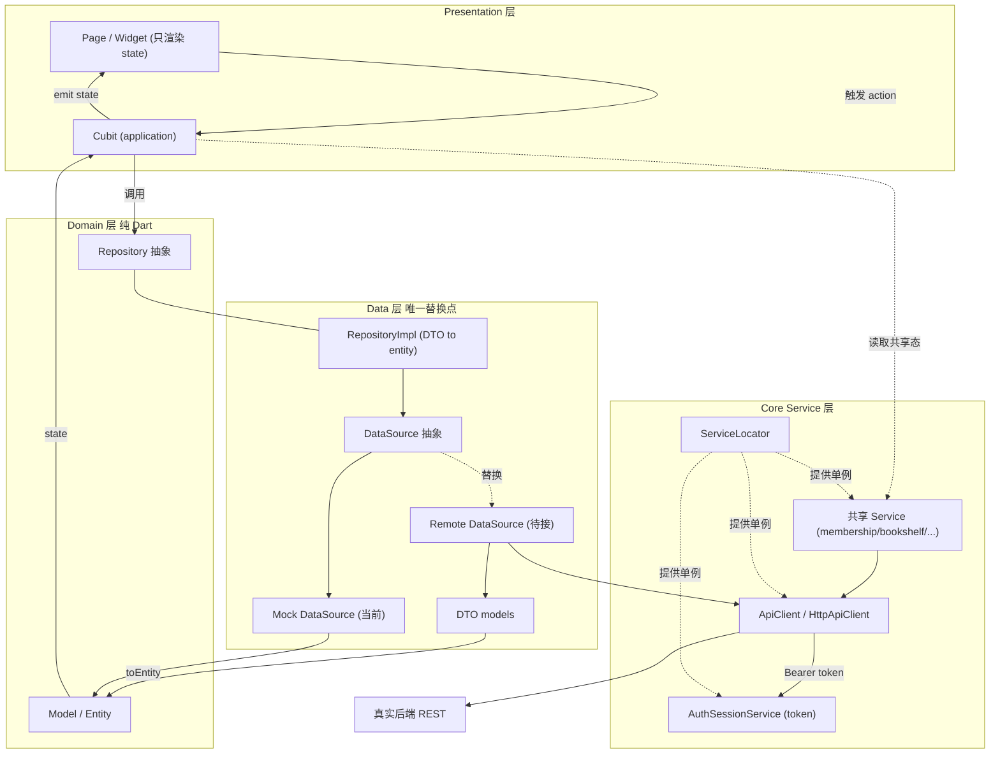
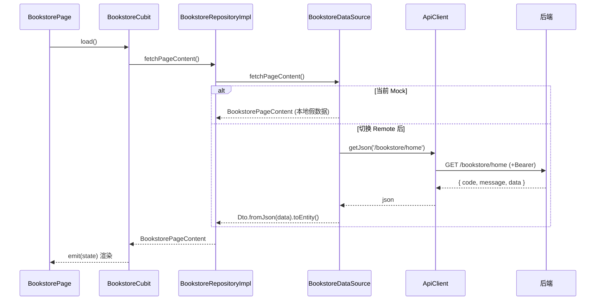

# 07 · 数据流（Data Flow）

> 梳理全项目「数据来源 → Repository → Model → Service → UI」的分层流转，并标明真实 API 的唯一替换位置。**约束：接入真实接口只改 data 层（新增 remote datasource + DTO）与注入点，UI / application / domain 均不动。** 接口清单见 [08_API.md](./08_API.md)。返回 [文档导航](./README.md)。

## 1. 分层职责与当前数据来源

| 层 | 角色 | 当前实现 | 位置 |
|---|---|---|---|
| **数据来源 DataSource** | 提供原始数据 | **Mock 为主**（`*_mock_datasource.dart` / `home_local_datasource.dart`）；仅 `bookstore`、`search` 另有 `*_remote_datasource.dart` | `features/<name>/data/datasources/` |
| **Repository** | domain 数据契约（UI 只认抽象） | `RepositoryImpl` 依赖 `*_data_source.dart` 抽象，做 DTO→entity 映射与错误归一 | `features/<name>/domain/repositories/`（抽象）+ `data/repositories/`（实现） |
| **Model** | 数据形态 | domain entities（纯 Dart，`Book`/`BookstorePageContent`/…）；data 层 DTO（`*_dto.dart`，仅 bookstore/search 已建） | `features/<name>/domain/entities/`、`core/domain/entities/`、`data/models/` |
| **Service** | 跨 feature 能力/会话/网络 | `ServiceLocator` 单例：`authService`(mock/rest)、`authSession`、`apiClient`、`membershipStatus`、`bookshelfMembership`、`onboarding`、`imagePicker`、`socialAppLaunch` | `core/services/`、`core/network/` |
| **UI** | 渲染 state、触发 action | `Page` 订阅 `Cubit` 的 state（UI/Domain/Interaction 分离），只读不改数据 | `features/<name>/presentation/` |

**关键事实**：
- 全仓真实网络仅两条通路已就绪——① `auth` 经 `RestAuthService → ApiClient`；② `bookstore`/`search` 的 `*_remote_datasource → ApiClient`（且默认仍注 Mock）。其余 feature 全部 Mock。
- 统一网络客户端 `HttpApiClient`（[api_client.dart](../lib/core/network/api_client.dart)）自动拼 baseUrl、注入 `Bearer` token（取自 `authSession`）、超时与 `ApiException` 映射；baseUrl 经 `--dart-define=API_BASE_URL` 注入（[api_config.dart](../lib/core/network/api_config.dart)）。
- 服务注入总入口 [service_locator.dart](../lib/core/services/service_locator.dart)（后续可换 `get_it`/`riverpod`）。

## 2. 整体数据流图



## 3. 单次请求时序（以 bookstore 为例）



## 4. 真实 API 应在哪里替换

**唯一替换层 = `features/<name>/data/`，共 3 步（domain / application / presentation 全不动）：**

1. **建 DTO + 映射**：`features/<name>/data/models/<name>_dto.dart`，`fromJson` 解析后端字段、`toEntity()` 映射到 domain entity（domain 保持无 json）。参考 [bookstore_page_dto.dart](../lib/features/bookstore/data/models/bookstore_page_dto.dart)、[search_dtos.dart](../lib/features/search/data/models/search_dtos.dart)。
2. **写 Remote DataSource**：`features/<name>/data/datasources/<name>_remote_datasource.dart`，`implements <Name>DataSource`，经 `ServiceLocator.apiClient` 调接口、读 `json['data']` 信封。参考 [bookstore_remote_datasource.dart](../lib/features/bookstore/data/datasources/bookstore_remote_datasource.dart)、[search_remote_datasource.dart](../lib/features/search/data/datasources/search_remote_datasource.dart)。
3. **切换注入点**：把 Cubit 默认或路由构造里的 Mock 换成 Remote，例如：

```dart
BookstoreCubit({BookstoreRepository? repository})
  : _repository = repository ??
      BookstoreRepositoryImpl(
        BookstoreRemoteDataSource(ServiceLocator.apiClient), // ← 由 Mock 改为 Remote
      );
```

**各替换点速查**（Cubit 注入位置见 [06_Pages.md](./06_Pages.md)）：

| Feature | DataSource 抽象 | 现状 | 替换动作 |
|---|---|---|---|
| bookstore | `bookstore_data_source.dart` | Remote 已写，默认注 Mock | 注入点换 Remote |
| search | `search_data_source.dart` | Remote 已写，默认注 Mock | 注入点换 Remote |
| auth | 无（走 `AuthService`） | `RestAuthService` 已写 | `AuthServiceConfig.environment = rest` |
| home / category / ranking / editor_pick / book_detail / book_discussion / bookshelf / partner / welfare / currency_wallet / energy_records / dress_up / profile / account_settings / my_messages / settings / help_feedback | 各自 `*_data_source.dart` | 仅 Mock | 新增 Remote（3 步） |
| membership | 无抽象（静态 getter）+ `MembershipStatusService` | Mock | 补 `*_data_source.dart` 抽象或实现真实 `MembershipStatusService` |
| card_pack / recharge_records | 无 | 占位页 | 从零补 domain/data/application |

## 5. 特殊数据流（不走 feature Repository）

- **会话/鉴权**：`LoginCubit → AuthRepository → AuthService(Rest/Mock) + AuthSessionService`；token 存于 `authSession`，被 `ApiClient` 自动读取注入。**待办**：`InMemoryAuthSessionService` 重启即失效，接入前替换为安全存储。
- **跨页共享态**（本地服务，非后端）：加/删书架 `BookshelfMembershipService`、会员/用户态 `MembershipStatusService`、新手信息 `OnboardingService`、选图 `ImagePickerService`、第三方拉起 `SocialAppLaunchService`。接真实后端时，这些 service 内部改为经 `ApiClient` 调接口（对 UI 透明）。
- **本地模拟的写操作**：签到、送心/点赞/评论、猜你喜欢分页、装扮穿戴、会员开通等目前在 Cubit 内本地乐观更新，接入时在对应 Repository/DataSource 增加写方法并回填服务端结果。

## 6. 约定（强制）

- **错误映射只在 data 层**：datasource/repository 捕获 `ApiException`，映射为各 feature 失败态或 `errorMessage`；UI 不接触 http 细节。
- **信封统一**：后端 `{ code, message, data }`，业务数据在 `data`。
- **domain 纯净**：entity 不含 json；DTO 只在 `data/models`。
- **UI 不改**：接入真实 API 全程不动 `presentation/`，所有改动集中在 `data/` 与注入点。
