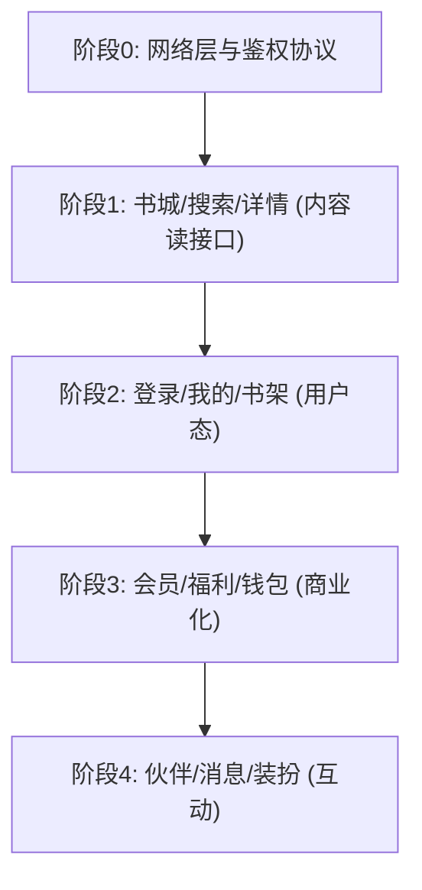

# 08 · API 接入说明（API）

> 汇总所有需后端接入的接口。列含：页面名称、当前是否假数据、Repository、Service、API 名称建议、Loading / Error / Empty 态、是否已预留接口位置。API 路径与 [backend/API接口草案.md](./backend/API接口草案.md) 对齐（路径可按公司规范调整）。数据流详见 [07_DataFlow.md](./07_DataFlow.md)。返回 [文档导航](./README.md)。

**图例**：
- Loading/Error/Empty：`✓统一` = 走 `AppAsyncPageBody`（加载/错误重试/空态一体）；`骨架` = 书卡 skeleton 加载；`状态视图` = feature 自有 status views；`空态` = `EmptyState`；`~待补` = 该态尚未统一处理；`—` = 占位页无需。
- 预留：`Remote已就绪` = 已有 `*_remote_datasource`；`✓抽象` = 有 `*_data_source.dart` 抽象，新增 Remote 即可；`Service` = 走 core service；`✗从零` = 需从零补 data/application 层。

## 一、基础设施（已就绪）

| 能力 | 位置 | 说明 |
|---|---|---|
| 统一 REST 客户端 | [api_client.dart](../lib/core/network/api_client.dart) | `ApiClient`（抽象）+ `HttpApiClient`；自动拼 baseUrl、JSON headers、Bearer token 注入、超时与错误映射 |
| 全局配置 | [api_config.dart](../lib/core/network/api_config.dart) | `baseUrl` 经 `--dart-define=API_BASE_URL=...` 注入 |
| 统一异常 | [api_exception.dart](../lib/core/network/api_exception.dart) | `ApiException` + `ApiErrorType`（network/timeout/unauthorized/…） |
| 客户端单例 | `ServiceLocator.apiClient` | 已注入 `accessTokenProvider`（取当前会话 token） |
| 接入范式 | [rest_auth_service.dart](../lib/core/services/rest_auth_service.dart) | 参考实现：如何发请求、读 `data` 信封、映射失败 |
| 测试范式 | `test/core/network/api_client_test.dart` | 用 `http` 的 `MockClient` 注入桩响应做单测 |

运行真实环境：`flutter run --dart-define=API_BASE_URL=https://api.example.com`，并把 `AuthServiceConfig.environment` 切到 `AuthEnvironment.rest`。

## 二、接入步骤（推荐，3 步）

已提供两个完整范例可照抄：`bookstore`（单方法聚合页）、`search`（多方法，7 接口）。以任一 feature 为例：

1. **建 DTO + 映射**：`features/<name>/data/models/<name>_dto.dart`（`fromJson` + `toEntity`）。
2. **写 Remote DataSource**：`features/<name>/data/datasources/<name>_remote_datasource.dart implements <Name>DataSource`，经 `ServiceLocator.apiClient` 调接口、读 `json['data']`。
3. **接环境开关**：cubit 默认注入用 [`ApiEnvConfig.isRest`](../lib/core/config/api_env.dart) 在 Remote / Mock 间选择（照 `bookstore`/`search` 已实现的 `_defaultRepository()`）；`RepositoryImpl`/domain/UI 均不改。

**环境切换（统一开关）**：缺省 `mock`（无后端不受影响）；启用真实接口：

```bash
flutter run --dart-define=API_ENV=rest --dart-define=API_BASE_URL=https://api.example.com
```

`bookstore` / `search` / `auth` 已接入该开关，切 `API_ENV=rest` 即走真实通路。

约定：错误映射只在 data 层；信封统一 `{ code, message, data }`；domain 纯净（json 只在 DTO）。

## 三、接口清单（按域）

### 1. 鉴权 / 用户态（最优先）

| 页面/模块 | 假数据 | Repository | Service | API 建议 | Loading | Error | Empty | 预留 |
|---|---|---|---|---|---|---|---|---|
| 登录 login | 是（Mock，`API_ENV=rest` 切 Rest） | `AuthRepository` | `AuthService`(Rest/Mock)、`AuthSessionService`、`SocialAppLaunchService` | `POST /auth/sms/send`、`/auth/sms/login`、`/auth/carrier/login`、`/auth/logout` | 按钮 loading | Toast/表单错误 | — | **已接环境开关**（`--dart-define=API_ENV=rest`） |
| 启动 splash | 是 | 无 | `AuthSessionService` | `GET /me`（校验会话） | 原生闪屏 | 回退登录 | — | Service（待换持久化） |
| 新手信息 onboarding | 是（内存） | 无 | `OnboardingService` | `POST /me/basic-info` | 按钮 loading | Toast | — | Service |

### 2. 书城 / 发现

| 页面/模块 | 假数据 | Repository | Service | API 建议 | Loading | Error | Empty | 预留 |
|---|---|---|---|---|---|---|---|---|
| 书城 bookstore | 是（默认 Mock，`API_ENV=rest` 切 Remote） | `BookstoreRepository` | `ApiClient` | `GET /bookstore/home`；`GET /bookstore/guess-like`(分页) | ✓统一 | ✓统一 | ✓统一 | **已接环境开关** |
| 分类 category | 是 | `CategoryRepository` | `ApiClient` | `GET /categories`、`GET /categories/books`(筛选+分页) | 骨架 | ~待补 | 空态 | ✓抽象 |
| 榜单 ranking | 是 | `RankingRepository` | `ApiClient` | `GET /rankings`(channel/dimension/分页) | 骨架 | ~待补 | 空态 | ✓抽象 |
| 编辑推荐 editor_pick | 是 | `EditorPickRepository` | `ApiClient` | `GET /editor-picks`(分页) | 骨架 | ~待补 | 空态 | ✓抽象 |
| 首页 home | 是（local） | `HomeRepository` | — | `GET /home/info` | ✓统一 | ✓统一 | ✓统一 | ✓抽象 |

### 3. 搜索

| 页面/模块 | 假数据 | Repository | Service | API 建议 | Loading | Error | Empty | 预留 |
|---|---|---|---|---|---|---|---|---|
| 搜索 search | 是（默认 Mock，`API_ENV=rest` 切 Remote） | `SearchRepository` | `ApiClient`、`BookshelfMembershipService`(加书架) | `GET /search`、`/search/suggestions`、`/search/hot-keywords`、`/search/recommendations`；`GET/POST/DELETE /me/search-history` | 骨架 | ~待补 | 空态（无结果/初始推荐） | **已接环境开关** |

### 4. 书籍详情 / 社区

| 页面/模块 | 假数据 | Repository | Service | API 建议 | Loading | Error | Empty | 预留 |
|---|---|---|---|---|---|---|---|---|
| 书籍详情 book_detail | 是 | `BookDetailRepository` | `BookshelfMembershipService`(加书架) | `GET /books/{id}`；写：`POST/DELETE /books/{id}/shelf`、`POST /books/{id}/heart` | 状态视图 | 状态视图 | 状态视图 | ✓抽象 |
| 书评详情 book_discussion | 是 | `BookDiscussionRepository` | — | `GET /books/{id}/comments`、`POST /comments/{id}/replies`、点赞 | ~待补 | ~待补 | 空态 | ✓抽象 |

> 详情页写操作（送心/点赞/回复/推荐换一换）当前为 Cubit 本地乐观更新，需接写接口并回填。

### 5. 书架

| 页面/模块 | 假数据 | Repository | Service | API 建议 | Loading | Error | Empty | 预留 |
|---|---|---|---|---|---|---|---|---|
| 书架 bookshelf | 是 | `BookshelfRepository` | `BookshelfMembershipService` | `GET /me/bookshelf`；写：`POST/DELETE /me/bookshelf/{id}`、`POST /me/bookshelf/batch-delete`、`GET /me/reading-history` | ✓统一（+骨架） | ✓统一 | ✓统一（空态） | ✓抽象 |

> 用户态强，需登录后返回个人数据；`loadMoreRecommendations()` 待接分页。

### 6. 我的 / 账号 / 资产

| 页面/模块 | 假数据 | Repository | Service | API 建议 | Loading | Error | Empty | 预留 |
|---|---|---|---|---|---|---|---|---|
| 我的 profile | 是 | `ProfileRepository` | `MembershipStatusService` | `GET /me/profile-page` | ✓统一 | ✓统一 | ✓统一 | ✓抽象 |
| 账号设置 account_settings | 是 | `AccountSettingsRepository` | `MembershipStatusService` | `GET /me/account-settings`、`PATCH /me/profile` | ✓统一 | ✓统一 | ✓统一 | ✓抽象 |
| 修改昵称 edit_nickname | 是（本地） | 无 | `MembershipStatusService` | `PATCH /me/profile` | 按钮 loading | Toast | — | Service |
| 钱包 currency_wallet | 是 | `CurrencyWalletRepository` | `ApiClient` | `GET /me/currencies/{type}/wallet`；`POST /orders/recharge`、`/me/stardust/exchange` | ✓统一 | ✓统一 | ✓统一 | ✓抽象 |
| 能量记录 energy_records | 是 | `EnergyRecordsRepository` | — | `GET /me/currencies/{type}/records`(分页) | ✓统一 | ✓统一 | ✓统一（空态） | ✓抽象 |

### 7. 会员 / 福利

| 页面/模块 | 假数据 | Repository | Service | API 建议 | Loading | Error | Empty | 预留 |
|---|---|---|---|---|---|---|---|---|
| 会员 membership | 是 | `MembershipRepository`（静态内容 getter） | `MembershipStatusService` | `GET /membership/page`；`POST /membership/activate` | ✓统一 | ✓统一 | ✓统一 | **需补抽象**+真实 `MembershipStatusService` |
| 会员权益详情 benefits_detail | 是 | `MembershipRepository` | — | `GET /membership/benefit-details` | 页面内 | 页面内 | — | 同上 |
| 充值记录 recharge_records | 是（占位） | 无 | — | `GET /me/currencies/records` 或 `/orders/recharge/records` | — | — | 空态 | ✗从零 |
| 福利 welfare | 是 | `WelfareRepository` | `ApiClient` | `GET /welfare/page`；`POST /welfare/check-in`、`/welfare/tasks/{id}/claim`、`/welfare/ad-reward/claim` | ✓统一 | ✓统一 | ✓统一 | ✓抽象 |

> 签到/任务领取/看广告当前本地切状态，需接写接口返回奖励与当天状态。

### 8. 伙伴 / 消息 / 互动

| 页面/模块 | 假数据 | Repository | Service | API 建议 | Loading | Error | Empty | 预留 |
|---|---|---|---|---|---|---|---|---|
| 伙伴 partner | 是 | `PartnerRepository` | `ApiClient` | `GET /partner/page`；拆分 `/partner/characters`、`/partner/conversations`、`/partner/interaction-scenes`、收藏/已读写接口 | ✓统一 | ✓统一 | ✓统一（空态） | ✓抽象 |
| 我的消息 my_messages | 是 | `MyMessagesRepository` | — | `GET /me/messages`(tab/分页)、`GET /me/messages/unread-counts`、`POST /me/messages/{id}/read`、`/read-all` | ~待补 | ~待补 | 空态 | ✓抽象 |

> partner 筛选/排序/加载更多当前前端本地处理，数据量大后建议后端分页。

### 9. 装扮 / 卡包

| 页面/模块 | 假数据 | Repository | Service | API 建议 | Loading | Error | Empty | 预留 |
|---|---|---|---|---|---|---|---|---|
| 装扮 dress_up | 是 | `DressUpRepository` | — | `GET /dress-up/page`；`POST /dress-up/{id}/equip`、`/dress-up/{id}/buy` | ✓统一 | ✓统一 | ✓统一 | ✓抽象（写方法待补） |
| 卡包 card_pack | 是（占位） | 无 | — | `GET /me/card-pack` | — | — | 空态 | ✗从零 |

### 10. 帮助反馈 / 设置

| 页面/模块 | 假数据 | Repository | Service | API 建议 | Loading | Error | Empty | 预留 |
|---|---|---|---|---|---|---|---|---|
| 帮助反馈 help_feedback | 是 | `HelpFeedbackRepository` | `ImagePickerService`(截图) | `GET /help-feedback/page`；`POST /help-feedback/feedback` | ✓统一 | ✓统一 | ✓统一（空态） | ✓抽象 |
| 设置 settings | 是 | `SettingsRepository` | `AuthService`/`AuthSessionService`(登出) | `GET /settings/page` | ✓统一 | ✓统一 | ✓统一 | ✓抽象 |
| 协议/文档 settings_document | 是 | 无（路由直调 Mock） | — | `GET /documents/{type}`（可 CMS） | — | — | — | 直调数据源 |
| 阅读偏好 / 通知 / 个性化广告 / 青少年模式 | 是（内存/占位） | 无 | — | `GET/PATCH /me/preferences`、`/me/notification-settings` 等 | — | — | — | ✗从零（纯内存 cubit） |

## 四、汇总结论

- **需后端接入的页面/模块共约 30 项**；当前**全部为假数据**（`auth` 可切 Rest、`bookstore`/`search` Remote 已写但默认仍 Mock）。
- **接口位置预留度高**：除 `membership`（静态 getter，需补抽象）、`card_pack`/`recharge_records`/settings 部分子页（占位，需从零）外，**其余均已有 `*_data_source.dart` 抽象**，接入只需新增 `*_remote_datasource.dart` + DTO + 切注入点。
- **状态处理成熟度**：13 个主要 Tab/二级页已用 `AppAsyncPageBody` 统一 Loading/Error(重试)/Empty；列表型页面（category/ranking/editor_pick/search）用骨架 + `EmptyState`，**Error 态建议统一收敛到 `AppAsyncPageBody`**；占位页仅空态。
- **写操作缺口**：加书架、送心/点赞/评论、签到、任务领取、会员开通/支付、装扮穿戴/购买、消息已读——均需补写接口并回填服务端结果（当前本地乐观更新）。

## 五、分阶段接入计划

> 总原则：① 先读接口再写接口；② 先内容接口再用户态；③ 页面层不动、优先替换 data 层；④ 保留 mock 便于预览/降级；⑤ 每模块都要 loading / empty / error 三态。



| 阶段 | 模块 | 关键接口 | 前端替换点 |
|---|---|---|---|
| 0 | 网络层/鉴权协议 | 约定包裹格式、错误码、分页、图片 URL、token 刷新 | `core/network/*`（已就绪） |
| 1 | 书城 | `GET /bookstore/home`、`/bookstore/guess-like`、`/rankings` | `bookstore` remote datasource（已就绪，切注入） |
| 1 | 搜索 | `GET /search/hot-keywords`、`/search/suggestions`、`/search`、`/search/recommendations` | `search` remote datasource（已就绪，切注入） |
| 1 | 书籍详情 | `GET /books/{id}`、`/books/{id}/comments` | 新增 `book_detail` remote datasource |
| 2 | 登录 | `POST /auth/sms/send`、`/auth/sms/login`、`/auth/carrier/login`、`/auth/logout`、`GET /me` | `rest_auth_service` + `auth_session_service`（切 rest + 持久化） |
| 2 | 我的/账号 | `GET /me/profile-page`、`PATCH /me/profile` | `profile` / `account_settings` remote datasource |
| 2 | 书架 | `GET /me/bookshelf`、`POST/DELETE /me/bookshelf/{id}`、`/me/reading-history` | `bookshelf` remote datasource + `bookshelf_membership_service` |
| 3 | 会员 | `GET /membership/page`、`POST /membership/activate`、`GET /me/membership` | `membership` datasource + 真实 `membership_status_service` |
| 3 | 福利 | `GET /welfare/page`、`POST /welfare/check-in`、`/welfare/tasks/{id}/claim` | `welfare` remote datasource |
| 3 | 钱包 | `GET /me/currencies`、`/me/currencies/{type}/wallet`、`/records`、`POST /orders/recharge`、`/me/stardust/exchange` | `currency_wallet` / `energy_records` remote datasource |
| 4 | 伙伴 | `GET /partner/page`、`/partner/characters`、`/partner/conversations`、`/partner/interaction-scenes` | `partner` remote datasource |
| 4 | 我的消息 | `GET /me/messages`、`/me/messages/unread-counts`、`POST /me/messages/{id}/read` | `my_messages` remote datasource |
| 4 | 装扮/卡包 | `GET /dress-up/page`、`POST /dress-up/{id}/equip`、`/buy`、`GET /me/card-pack` | `dress_up` remote datasource（+card_pack 从零建） |

### 最小首批清单（后端第一周）

让 App 从「静态 UI 预览」进入「真实内容 + 用户登录」最小闭环，优先交付这 7 个：

1. `GET /bookstore/home`
2. `GET /search?q=`
3. `GET /search/suggestions?q=`
4. `GET /books/{bookId}`
5. `POST /auth/sms/send`
6. `POST /auth/sms/login`
7. `GET /me`

### 前端每模块自测清单

首屏 loading · 请求成功 · 请求失败 · 空列表 · 图片 URL 失败 · 分页到底 · 登录过期。

### 每个接口需前后端对齐 5 件事

页面入口/截图 · 请求参数 · 响应 JSON 示例 · 空/错误状态 · 分页或刷新策略。

> 后端字段级草案与响应示例见 [backend/API接口草案.md](./backend/API接口草案.md)、[backend/字段模型对照.md](./backend/字段模型对照.md)。
