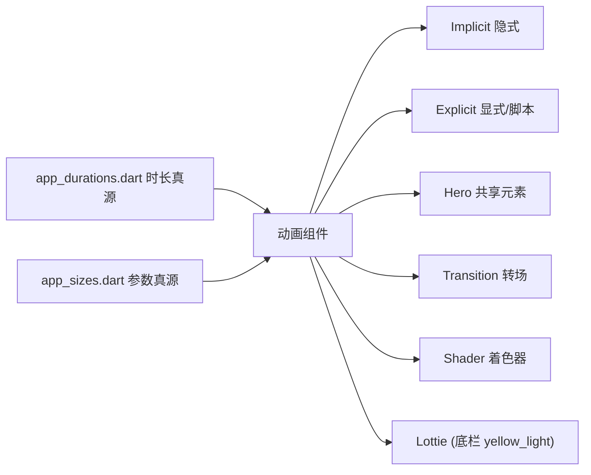

# 10 · 动画（Animation）

> 全项目动画清单，按类型归类。时长真源统一 [app_durations.dart](../lib/core/theme/app_durations.dart)，动画参数（缩放比/阈值/blur）走 [app_sizes.dart](../lib/core/theme/app_sizes.dart)，**禁止写死 `Duration(...)` / 裸数值**。组件说明见 [05_Components.md](./05_Components.md)。返回 [文档导航](./README.md)。

## 分类总览

## 1. Implicit（隐式动画）

由 `AnimatedXxx` / 插值驱动，声明式。

| 能力 | 组件 / 位置 | 说明 |
|---|---|---|
| 数字滚动 | `AnimatedCountText`（[animated_count_text.dart](../lib/shared/widgets/animated_count_text.dart)） | 数值变化从旧值滚到新值，时长 `numberRoll` |
| Tab 文字过渡 | `AppAnimatedTabLabel`（[app_animated_tab_label.dart](../lib/shared/components/app_animated_tab_label.dart)） | 选中/未选中样式插值；点击切换仅 from/to 两端交叉过渡（不扫过中间索引），跟手滑动仍按连续进度插值 |
| Tab 指示条 | `ElasticTabIndicator`（[elastic_tab_indicator.dart](../lib/shared/components/elastic_tab_indicator.dart)） | 平移 + 宽度拉伸回弹（§3.5 规范：弹性只作用于宽度恢复） |
| 底部导航图标 | `AppNavIcon`（[app_nav_icon.dart](../lib/shared/widgets/app_nav_icon.dart)） | `yellow_light`：选中播 Lottie 一次停末帧；`yellow_dark` 四 Tab：路径动效 700ms（`Nav*SelectIcon`）；其它：选中缩放微动画 |

## 2. Explicit / 脚本动画

由 `AnimationController` 驱动的显式/脚本动画。

| 能力 | 组件 / 位置 | 说明 |
|---|---|---|
| 按压反馈 | `AppPressable`（[app_pressable.dart](../lib/shared/widgets/app_pressable.dart)） | 缩小→反弹 overshoot→回正脚本；时长 `tapPressDown`/`tapPressRebound`，比例 `tapPressScale*` |
| CTA 呼吸 + 扫光 | `AppGradientCtaButton`（[app_gradient_cta_button.dart](../lib/shared/components/app_gradient_cta_button.dart)）；membership CTA | 时长 `membershipCtaBreath`/`membershipCtaSweep` |
| 扫光高亮 | `SweepHighlightOverlay`（[sweep_highlight_overlay.dart](../lib/shared/components/sweep_highlight_overlay.dart)） | 半透明带循环滑过 |
| 液态扫光裁剪 | `LiquidSweepCtaClip`（[liquid_sweep_cta_clip.dart](../lib/shared/components/liquid_sweep_cta_clip.dart)） | 强 CTA 边缘形变 |
| 骨架扫光 | `AppShimmer`（[app_shimmer.dart](../lib/shared/widgets/app_shimmer.dart)） | 时长 `shimmerSweep` |
| 礼花庆祝 | `AppConfetti`（[app_confetti.dart](../lib/shared/components/app_confetti.dart)） | `confetti` 包，时长 `confettiBurst` |
| 跑马灯 | `AppMarqueeText`（[app_marquee_text.dart](../lib/shared/widgets/app_marquee_text.dart)） | 溢出滚动，间隔 `marqueeInterval` |

> 扫光/液态系列（`SweepHighlightOverlay`/`LiquidSweepCtaClip`/`AppGradientCtaButton`/`VipPromoBanner`）共享扫光引擎，建议后续统一底层动画（见 [12_TechLeadReview.md](./12_TechLeadReview.md)）。

## 3. Hero（共享元素）

| 能力 | 组件 / 位置 | 说明 |
|---|---|---|
| 书封飞行转场 | `bookCoverHeroRectTween` / `bookCoverHeroFlightShuttleBuilder`（[book_cover_hero.dart](../lib/shared/widgets/book_cover_hero.dart)） | 书卡→详情头图 Hero，弧线补间 + 交叉淡入 |
| 头图下拉视差 | `OverscrollStretch`（[overscroll_stretch.dart](../lib/shared/widgets/overscroll_stretch.dart)） | overscroll 按视差比例放大头图 |

## 4. Transition（转场）

| 能力 | 组件 / 位置 | 说明 |
|---|---|---|
| 容器转换（卡片→全屏） | `AdvancedTransitionWrapper`（[advanced_transition_wrapper.dart](../lib/shared/widgets/advanced_transition_wrapper.dart)） | 基于 `animations` 包 `OpenContainer`，时长 `containerTransform`（welfare 充值详情） |
| Tab 内容跟手切换 | `AppSwipeTabSwitcher`（[app_swipe_tab_switcher.dart](../lib/shared/components/app_swipe_tab_switcher.dart)） | PageView / 手势跟手，顶部 chrome 固定（§3.4 规范） |
| 讨论新评论高亮 | 书详情讨论列表 `_DiscussionCard` | 发送后粉 8% 底 `discussionNewCommentHighlight`（`pink500Alpha08`）通栏无圆角，停留 `AppDurations.discussionNewCommentHighlight`（5s）后 `AnimatedContainer` 淡出 |
| 讨论新评论滚入 | 书详情页 `_BookDetailView` | `highlightedDiscussionPostId` 变更后双帧 `ensureVisible`，时长 `AppDurations.normal`，对齐 `bookDetailNewCommentScrollAlignment` |

## 5. Shader（片元着色器）

| 能力 | 资源 / 组件 | 说明 |
|---|---|---|
| 极光背景 | `assets/shaders/aurora.frag` → `AuroraBackground`（[aurora_background.dart](../lib/shared/widgets/aurora_background.dart)） | GLSL 动画背景，失败回退静态渐变（partner / membership） |
| 液态按钮 | `assets/shaders/liquid_button.frag` | 液态扫光按钮效果 |

## 6. Lottie

- 底栏：`yellow_light` 走 Lottie（[09_Assets.md](./09_Assets.md) §6）；`yellow_dark` 四 Tab 接入 `Nav*SelectIcon` 路径动效（`AppDurations.bottomNavSelectMotion`）；由 `AppNavIcon` 驱动选中播一次。
- 封装组件 `AppLottie`（[app_lottie.dart](../lib/shared/components/app_lottie.dart)）支持循环播放或外部 `controller`。
- 接入其它场景：把 `.json`（及同级 `images/`）放入 `assets/lottie/`，经 `AppThemeAssets` / `AppSharedAssets` 语义路径引用。

## 7. Rive

**未使用**。项目动效由上述 Implicit / Explicit / Hero / Transition / Shader / Lottie 承担。

## 8. 规范

- 时长走 `AppDurations`，参数走 `AppSizes`；禁止写死 `Duration(...)` 与裸缩放/阈值数值。
- 曲线遵循规则约定：Tab 指示条弹性只作用于**宽度拉伸恢复**，位移用平滑曲线（§3.5）。
- 新增通用动画组件：无业务进 `shared/widgets`；仅本 feature 放该 feature `presentation/components/`。
