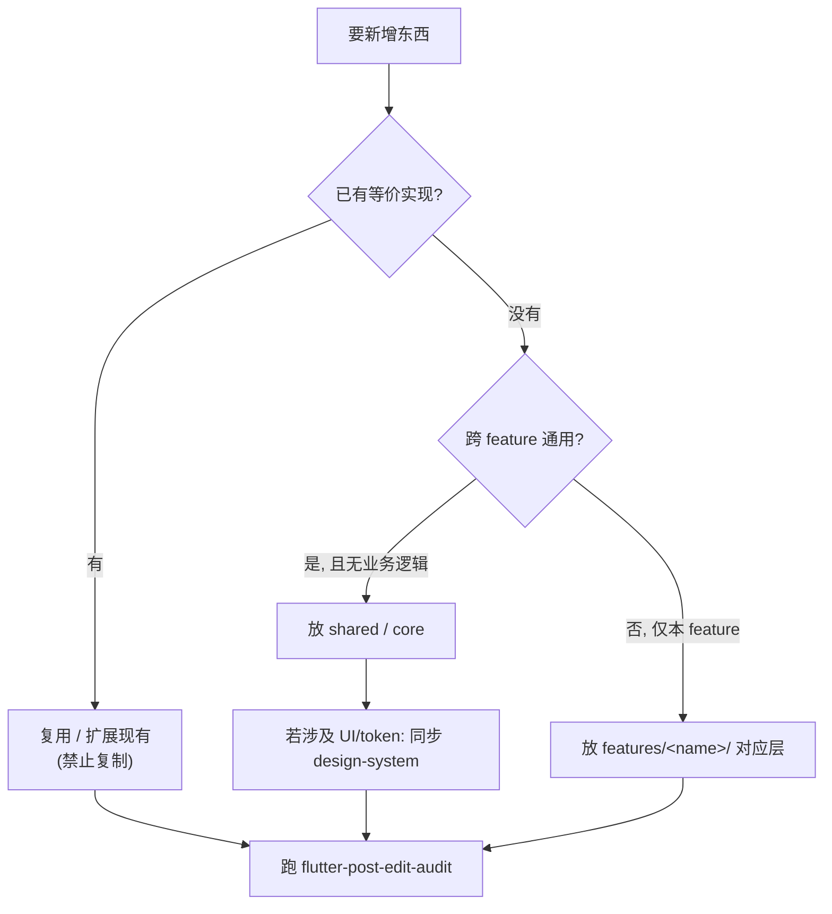

# 11 · 研发开发规范 & 扩展指南（Development Guide）

> 权威来源：架构规范 [.cursor/rules/flutter-architecture-strict-v2.mdc](../.cursor/rules/flutter-architecture-strict-v2.mdc)（STRICT V2）+ UI 唯一权威 [design-system/README.md](../design-system/README.md)。本篇是面向交接的落地摘要，冲突时以上述两处为准。返回 [文档导航](./README.md)。

---

# A · 开发规范

## A1. 哪些代码允许修改

| 场景 | 允许改的位置 |
|---|---|
| 接真实接口 | `features/<name>/data/`（新增 `*_remote_datasource.dart` + `data/models/*_dto.dart`）与 Cubit/路由注入点 |
| 新增业务页面 | 目标 feature 的 `presentation/pages/` + `presentation/components/`；需要数据则补 `data`/`domain`/`application`，并在 `index.dart` 导出 |
| 新增业务逻辑/状态 | `features/<name>/application/`（Cubit + State），domain 补 entity/repository 抽象 |
| 调整业务 UI 布局 | 该 feature 的 `presentation/components/`（仅组合，不写死样式、不含业务规则外的逻辑） |
| 调整全局样式基线 | `core/theme/*` token 真源（改一处全局生效，随后同步 design-system） |
| 新增/迭代共享组件 | `shared/widgets`(L1) / `shared/components`(L2)（满足复用门槛），同步 design-system |
| 路由注册 | `routes/groups/*` + `app_routes.dart` |

## A2. 哪些代码不要修改

| 禁改 / 谨慎 | 原因 |
|---|---|
| `AppPalette` 深色（yellow_dark）原色 | 主题实验默认基线，规则明令不得改动（§0.1 / brand colors §A） |
| 页面内**写死样式** | 禁止 `Color(0x…)`、`fontSize:数字`、`EdgeInsets.all(数字)`、`BorderRadius.circular(数字)`、`BoxShadow(...)`；必须回 token 真源改 |
| `domain/` 引入 Flutter/http/json | domain 必须纯 Dart（entity/value object/interface） |
| 反向依赖 | 禁止 `domain→application`、`data→presentation`、`core→features` |
| 跨 feature 引用实现层 | 禁止 `features/A` import `features/B` 的 `data/*` 或 `application/*` |
| 裸 `Navigator.push` | 必须走 `AppRouter`；弹窗必须走 `showAppBlurredDialog`（禁止 feature 内直调 `showDialog`） |
| 自动生成/临时目录 | `.dart_tool/`、`build/`、`ios/Flutter/ephemeral/`、`android/.gradle/`、`.metadata`（工具维护） |
| 预览入口误当正式入口 | `lib/previews/*` 仅调试/CI，不写业务 |

## A3. 哪些内容必须复用

| 类别 | 必用 |
|---|---|
| 颜色/字体/圆角/间距/时长 | `AppColors` / `AppTextStyles` / `AppRadius` / `AppSpacing` / `AppSizes` / `AppDurations`（禁止另造字面量） |
| 文字/按钮/图标/开关/封面 | `AppText` / `AppButton` / `AppIcon` / `AppAssetImage` / `AppSwitch` / `BookCover` 等 L1 原子 |
| 顶栏/页面骨架 | `AppTopBar` + `AppPageChrome`（二级页），状态栏留白统一 `AppLayout.statusBarHeight(context)` |
| 异步页 | `AppAsyncPageBody`（Loading/Error/Empty 一体），空态 `EmptyState` |
| 弹窗 | `showAppBlurredDialog`（80% 遮罩，无背景模糊）+ `AppConfirmDialog` / `DialogCloseButton` |
| Tab/分段/指示器 | `AppTopTabBar` / `AppSwipeTabSwitcher` / `ElasticTabIndicator` / `AppSegmentedSwitch`（同款跟手过渡与弹性指示） |
| 书卡 | `BookGridCard` / `BookCardLargeRow` + 骨架 `book_card_skeletons`（勿新造书卡） |
| 跳转/会话/网络 | `AppRouter`、`ServiceLocator.*`、`ApiClient`（真实接口统一经此） |

## A4. 哪些内容统一维护（单一真源）

| 真源 | 位置 | 改动即全局 |
|---|---|---|
| 设计 token（色/字/圆角/间距/尺寸/时长） | `core/theme/*` | 改一处，全站生效 |
| UI 设计规范权威 | `design-system/README.md` + `*.canvas.tsx` | 三处一致（README + canvas 源 + Cursor 托管副本），改后跑 `scripts/sync-canvas.sh` |
| 共享组件 | `shared/widgets`(L1) / `shared/components`(L2) / `shared/layouts` | 全站复用的唯一出处 |
| 跨 feature 服务 | `core/services/`（`ServiceLocator` 注册） | 会话/会员/书架/网络等单例 |
| 跨 feature 共享模型 | `core/domain/entities/`（`Book`/`AuthUser`/…） | feature 间协作的唯一合法契约 |
| 网络底座 | `core/network/`（`ApiClient`/`ApiConfig`/`ApiException`） | 统一 baseUrl/鉴权/错误映射 |
| 路由 | `routes/`（`AppRouter` + `groups/`） | 统一注册与跳转入口 |
| 常量/配置 | `core/constants/`（`main_tab_config`/`currency_config` 等） | 全局常量单一出处 |

## A5. 哪些内容禁止重复开发

- **禁止重复造 token**：新色/新字号/新圆角/新间距若已有等价档位，直接引用；确需新增须**先停下征询**并同步 design-system（§0.1 规则 3）。
- **禁止复制组件**：同类 UI 已有 shared 组件（书卡、顶栏、弹窗、空态、Tab、分段、指示器、按压反馈…）不得在 feature 内另写一份；缺变体则扩展现有组件。
- **禁止重复封装弹窗/跳转/网络**：一律复用 `showAppBlurredDialog` / `AppRouter` / `ApiClient`。
- **禁止跨 feature 复制业务模型**：共享模型进 `core/domain`，通过契约协作，不在多 feature 各写一份。
- **禁止重复状态栏留白逻辑**：统一 `AppLayout.statusBarHeight(context)`，禁止各页重写 `topInset > 0 ? … : 44`。
- **禁止重复卡片层级**：分组卡内多行列表用 `Padding`/`Divider`，禁止卡内再套卡（§3.3）。

## A6. 分层与组件分级（速记）

```
依赖方向：presentation → application → domain → data ；core → all ；shared → core only
组件分级：L1 shared/widgets（原子）→ L2 shared/components（组合）→ L3 features/*/presentation/components（仅本 feature）
进入 shared 门槛：≥3 处复用 且 无业务逻辑；反之保留在 feature（防 shared 污染）
```

## A7. 拆分与性能红线

- 必拆分：widget > 150 行、file > 300 行、嵌套 > 5 层（token registry `app_sizes.dart`/`app_text_styles.dart` 经规则豁免）。
- 列表必用 `ListView.builder`；避免全局 rebuild；state 局部订阅；大 widget `const`/memoize；图片按需加载。

## A8. 提交前自检清单

1. 属于哪一层？是否违反依赖方向？
2. 样式是否全走 token（无写死 `Color`/`fontSize`/`EdgeInsets`/`Radius`/`BoxShadow`）？
3. 是否可复用 shared，而非新造/复制组件？
4. 是否引入跨 feature 实现层依赖？
5. 页面顶部是否用 `AppLayout.statusBarHeight` 预留状态栏？
6. 弹窗走 `showAppBlurredDialog`、跳转走 `AppRouter`？
7. 改了 `lib/` Dart？→ 执行 `.cursor/skills/flutter-post-edit-audit` 审计 + `flutter analyze`。
8. 改了 `core/theme` 或 `design-system/`？→ 保证 README + canvas + 托管副本三处一致并同步。
9. 更新受影响的 `docs/` 章节 + 追加 `CHANGELOG.md`。

---

# B · 扩展指南（新增各类元素放哪里）

> 核心判据：**先问「是否已有？能否复用/扩展？」，再问「属于哪一层？跨不跨 feature？」**。



## B1. 新增页面

- 已有 feature：`features/<name>/presentation/pages/<xxx>_page.dart`，拆分组件进同级 `components/`，`index.dart` 导出。
- 全新业务域：新建 `features/<new>/{data,domain,application,presentation,index.dart}`。
- 骨架：二级页 `AppPageChrome`+`AppTopBar`；Tab 根页挂 `MainTabShell`；异步数据 `AppAsyncPageBody`；状态栏 `AppLayout.statusBarHeight(context)`。
- 路由：`routes/groups/<域>_routes.dart` 注册，常量入 `app_routes.dart`，跳转走 `AppRouter`。
- 状态：Cubit + State 放 `application/`（State 分 UI/Domain/Interaction）。
- 最小骨架：`page → cubit → repository(抽象) → repositoryImpl → dataSource(抽象) → mock`。

## B2. 新增按钮

- 常规：**不新建**，用 `AppButton`（`variant`: accent/secondary/outline/vip；`size`: normal/small/compact）。
- 缺变体：**扩展** `AppButtonVariant`/`AppButtonSize`（[app_button.dart](../lib/shared/widgets/app_button.dart)）。
- 渐变/扫光 CTA：`AppGradientCtaButton`；顶栏按钮：`AppTopBarIconButton`/`AppTopBarTextButton`；按压反馈：`AppPressable`。
- 纯业务复合按钮（仅本 feature）：放 feature `components/`，内部仍复用 `AppButton`/`AppPressable`。

## B3. 新增卡片

- 书籍卡：`BookGridCard` / `BookCardLargeRow` + `book_card_skeletons`；封面 `BookCover`；角标 `BookCoverTagBadge`/`RankingRankBadge`。
- 分组信息卡：`AppGroupedListCard`（禁止卡内套卡）；导航行 `AppNavigationListRow`。
- 通用容器卡（跨 ≥3 feature、无业务）→ `shared/components/`；业务专用卡 → feature `components/`。

## B4. 新增 API

唯一改动层 = `features/<name>/data/` + 注入点，3 步（详见 [07_DataFlow.md](./07_DataFlow.md) / [08_API.md](./08_API.md)）：① DTO ② Remote DataSource（经 `ServiceLocator.apiClient`）③ 切注入点。网络固定用 `core/network/ApiClient`，**不要自建 http 封装**；错误只在 data 层映射。

## B5. 新增 Repository

- 抽象：`features/<name>/domain/repositories/<name>_repository.dart`（纯 Dart）。
- 实现：`features/<name>/data/repositories/<name>_repository_impl.dart`（依赖 `*_data_source.dart`）。
- 数据源抽象：`features/<name>/data/datasources/<name>_data_source.dart`。
- 注入：Cubit 构造默认或路由/`ServiceLocator`。跨 feature 不共享 Repository。

## B6. 新增 Model

- 本 feature 领域模型 → `features/<name>/domain/entities/`（纯 Dart，`Equatable`）。
- 跨 feature 共享 → `core/domain/entities/`。
- DTO → `features/<name>/data/models/*_dto.dart`（json↔entity）。
- UI/交互态 → `application/` 的 State，不进 domain。

## B7. 新增动画

- 时长入 `core/theme/app_durations.dart`；参数入 `app_sizes.dart`。
- 复用：按压 `AppPressable`、数字 `AnimatedCountText`、Tab `AppSwipeTabSwitcher`+`ElasticTabIndicator`、转场 `AdvancedTransitionWrapper`、骨架/扫光 `AppShimmer`/`SweepHighlightOverlay`/`LiquidSweepCtaClip`、背景 `AuroraBackground`、Lottie `AppLottie`。
- 详见 [10_Animation.md](./10_Animation.md)。

## B8. 新增 Theme / Token

| 想加什么 | 放哪里 | 注意 |
|---|---|---|
| 新原色 | `core/theme/app_palette.dart`（唯一 `Color(0x…)`） | 登记 design-system §4 |
| 品牌/主题壳色、新主题包 | `core/theme/app_brand_colors.dart` | 默认恒 `yellow_dark`，yellow_dark 分支不得改；`--dart-define=THEME=xxx` |
| 全局语义色 | `core/theme/app_colors.dart` | 页面只用语义名 |
| 字号/行高/字重/样式 | `app_text_styles.dart` | |
| 圆角/间距/尺寸 | `app_radius.dart` / `app_spacing.dart` / `app_sizes.dart` | |

**强制**：新增 token / 新档位 / 新色系须**先停下征询**，落地后同步 `design-system/`（三处一致，跑 `scripts/sync-canvas.sh`）。详见 [03_Theme.md](./03_Theme.md) / [04_DesignToken.md](./04_DesignToken.md)。

**三主题默认同步**：用户未特别声明时，UI / token / 组件外观改动须同时覆盖 `yellow_dark`、`pink_light`、`yellow_light`。详见 `.cursor/skills/flutter-post-edit-audit/references/design-system.md`。

## B9. 放置速查表

| 新增 | 首选位置 | 复用/真源 |
|---|---|---|
| 页面 | `features/<name>/presentation/pages/` | `AppPageChrome`+`AppTopBar`+`AppAsyncPageBody` |
| 按钮 | 复用 `AppButton` / 扩展变体 | `shared/widgets/app_button.dart` |
| 卡片 | `BookGridCard`/`AppGroupedListCard` 或 feature `components/` | `shared/components` |
| API | `features/<name>/data/datasources/*_remote_datasource.dart` | `core/network/ApiClient` |
| Repository | 抽象 `domain/repositories/` + 实现 `data/repositories/` | 依赖 `*_data_source.dart` |
| Model | feature `domain/entities/` 或 `core/domain/entities/`；DTO 进 `data/models/` | `Equatable` 纯 Dart |
| 动画 | 复用 shared 动画件 + `app_durations` token | `shared/widgets`、`core/theme/app_durations.dart` |
| Theme | `core/theme/*` 对应 token 文件 | 同步 `design-system/` |
