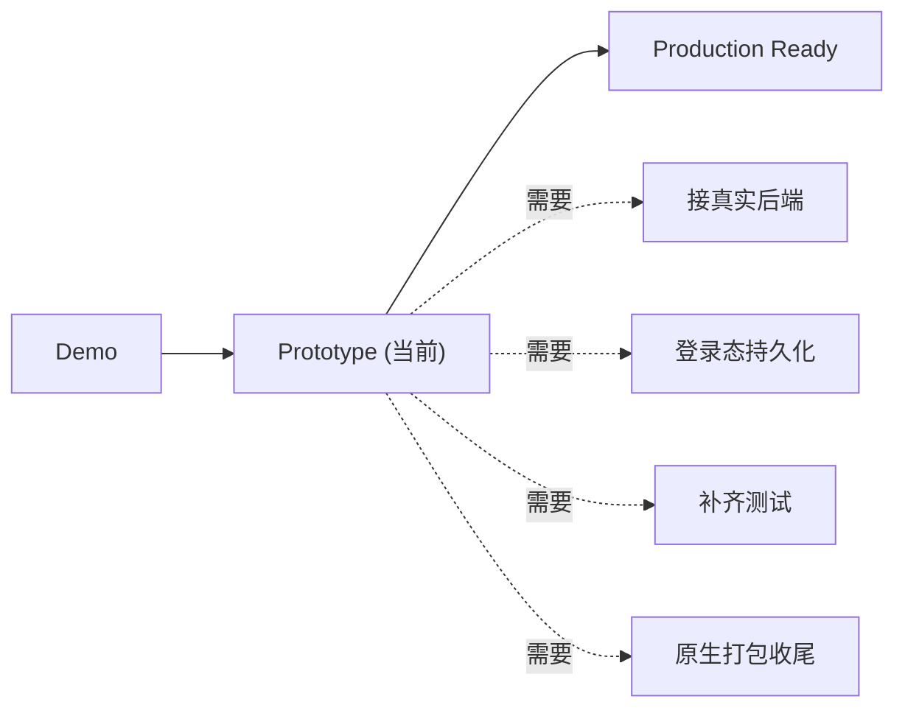

# 12 · Tech Lead 工程审核（Tech Lead Review）

> 站在 Flutter Tech Lead / 架构师视角对整个工程的最终审核结论与整改优先级。基于对全仓源码的实际扫描，非模板评价。返回 [文档导航](./README.md)。

## 1. 总体结论

**成熟度：高保真 Prototype（UI 接近功能完整、Mock 驱动）。** 工程规范性是本项目最大强项，距 Production 主要差在后端接入、登录态持久化、测试三块。

## 2. 强项（保持）

| 维度 | 评价 |
|---|---|
| 分层架构 | Feature First + 严格单向依赖（`core→all`/`shared→core`/`domain` 纯 Dart），23 个 feature 结构高度一致 |
| 设计 token | 三层色彩 + 字体/圆角/间距/时长 token；**实测 features 层 `Color(0x)`/`fontSize:`/`BorderRadius.circular(数字)` 命中均为 0** |
| 设计系统权威 | `design-system/`（README + canvas）作为 UI 唯一权威，三处一致机制 + 审计 skill |
| 契约先行 | `domain/repositories` 抽象 + `data` 实现，Mock/Remote 可替换；已提供 bookstore/search 两个 Remote 范例 |
| 状态分层 | State 拆 UI/Domain/Interaction；`AppAsyncPageBody` 统一异步态（13 页） |
| 网络底座 | `ApiClient` 统一 baseUrl/Bearer/超时/异常映射，接入范式清晰 |

## 3. 风险与技术债

| 项 | 现状 | 影响 | 建议 |
|---|---|---|---|
| 测试覆盖 | 仅 6 个测试文件 | 重构/接入回归无保障 | 补 cubit 单测 + repository 契约测试，`test/features/<name>/` 对齐源码 |
| 依赖注入 | 手写 `ServiceLocator` 单例 | 服务增多后可维护性下降、难做作用域/测试替身 | 迁 `get_it` 或 `riverpod` |
| shared/components 扁平 | 50+ 文件平铺 | 检索成本、易重复 | 按域分子目录（book_card/recharge/tab/dialog…） |
| shared 业务污染风险 | `EnergyRechargePurchaseDialog`/`RechargePackagesSection`/`VipPromoBanner`/`CurrencyBalanceBar` 含业务模型 | 违反 shared 无业务原则 | 使用面窄的下沉回 `currency_wallet`/`membership` |
| 未被引用组件 | `AppFocalCoverImage`/`AppLottie`/`GlassChipButton`/`BookListTile`/`BookCardRankingCompact`/`MainTabPlaceholder`/`showAppScrimDialog` | 死代码 | 接用或删除 |
| 书卡变体冗余 | `BookCardHorizontal`/`BookCardRankingCompact`/`BookListTile` 与主用 `BookCardVertical`/`BookCardLargeRow` 重叠 | 认知负担 | 收敛为单一书卡族 |
| Remote 覆盖 | 仅 `bookstore`/`search` 有 remote，且默认注 Mock | 真实接入未打通 | 按 [08_API.md](./08_API.md) 优先级推进 |
| 登录态持久化 | `InMemoryAuthSessionService` 重启失效 | 无法保持登录 | 换 `flutter_secure_storage` |
| 写操作本地模拟 | 加书架/签到/送心/评论/会员/装扮等本地乐观更新 | 与后端不一致 | 各 Repository 补写方法并回填 |
| `help_feedback` 契约 | 无独立 `domain/repositories` 抽象 | 与其它 feature 不一致 | 补齐统一 |
| 阴影体系 | 无独立 shadow token | 若引入投影易散落 | 需要时新增 `app_shadows.dart` |
| 原生工程 | android/ios/macos/web 模板级 | 无法发布 | 完善签名/权限/图标/`Info.plist` |

## 4. 整改优先级

1. **P0 打通用户态**：`auth` 切 `RestAuthService`（切配置即可）+ 登录态持久化。
2. **P0 接入范例落地**：`bookstore`/`search` 注入点切 Remote，作为其余 feature 模板。
3. **P1 用户态页面接入**：`bookshelf`/`profile`/`account_settings`/`my_messages`/`currency_wallet`/`membership`（含真实 `MembershipStatusService`）。
4. **P1 补测试**：核心 cubit + repository 契约测试。
5. **P2 写操作接口**：加书架/签到/送心点赞评论/会员支付/装扮穿戴。
6. **P2 工程整洁**：清理未引用组件、收敛书卡变体、`shared/components` 分子目录、偏业务组件下沉。
7. **P2 DI 升级**：`ServiceLocator` → `get_it`/`riverpod`。
8. **P3 占位页补链路**：`card_pack`、`membership/recharge_records`。
9. **P3 发布准备**：原生平台配置。

## 5. 结论

工程「骨架」达到企业级 Flutter 标准，可安全承载团队协作与持续迭代。当前阶段重心应从「造 UI」转向「接后端 + 补测试 + 清技术债」，即可稳步走向 Production Ready。
