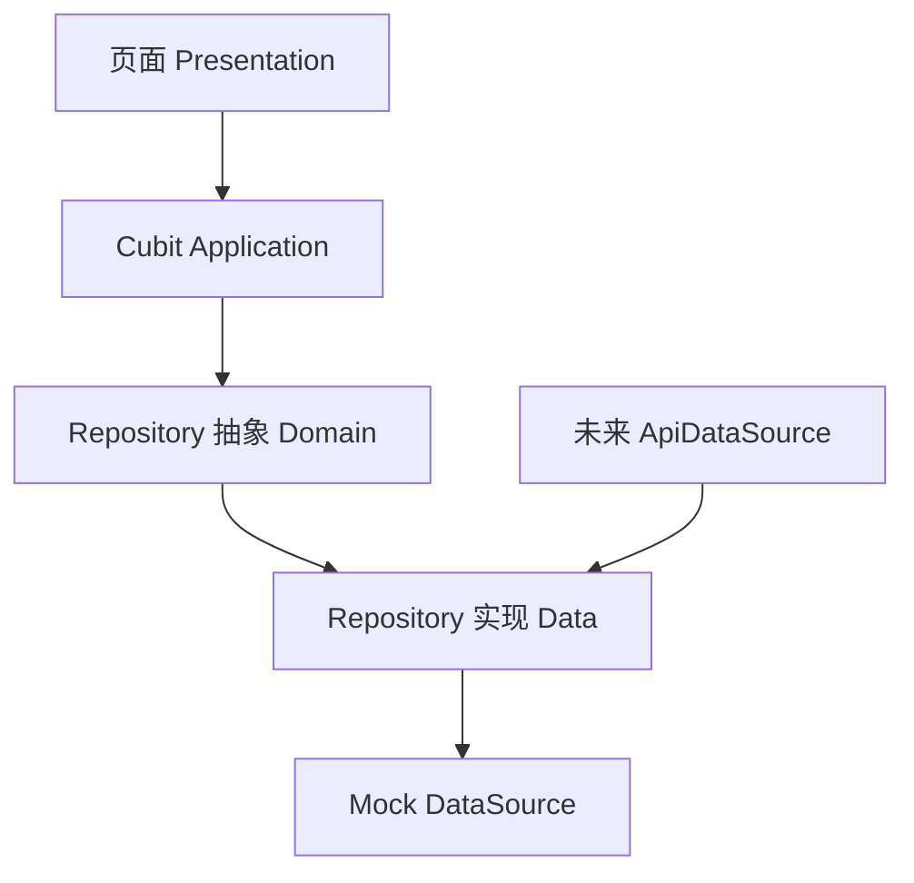

# 后端接入文档

这组文档给后端同事快速了解当前 Flutter 前端的数据结构和接口需求。当前页面风格和交互已基本完成，数据仍以 mock 为主，下一步可以按本文档逐步替换为真实接口。

## 快速入口

- [前端数据接入总览](./前端数据接入总览.md)：按页面列出 mock 数据源、仓储、领域模型和交互动作。
- [API 接口草案](./API接口草案.md)：按业务域整理建议接口、请求参数和响应结构。
- [字段模型对照](./字段模型对照.md)：把前端 domain entity 翻译成后端字段字典。
- [接入步骤建议](./接入步骤建议.md)：推荐的真实数据接入顺序和前端替换点。

## 当前架构

项目采用 feature-first 结构：

```text
lib/
  core/       # 主题、共享领域实体、全局服务、鉴权服务
  shared/     # 通用 UI 组件
  features/   # 业务模块，每个模块自带 data/domain/application/presentation
  routes/     # 路由
```

多数页面的数据流是：



后端接入时，建议保持 `presentation` 和 `application` 不动，优先替换 `data` 层：

- 新增 `ApiDataSource` / DTO / mapper。
- `RepositoryImpl` 依赖接口或根据环境选择 mock/api。
- domain entity 尽量保持稳定，必要时只做小幅补字段。

## 全局服务入口

- `lib/core/services/service_locator.dart`：当前服务定位入口。
- `lib/core/services/auth_service.dart`：登录服务抽象。
- `lib/core/services/rest_auth_service.dart`：真实登录接口占位。
- `lib/core/services/auth_session_service.dart`：登录 session 存取。
- `lib/core/services/membership_status_service.dart`：当前用户/VIP 状态。

## 当前关键事实

- 书籍封面字段当前多叫 `coverAsset`，值是本地资源路径。接真实接口时建议后端返回 `coverUrl`，前端后续可做 asset/url 兼容。
- 很多统计字段当前是展示字符串，如 `235.6`、`12.8万粉丝`。真实接口可以返回原始数字，但需要约定由前端还是后端格式化。
- 部分交互现在是本地模拟，如加载更多、加入书架、签到、送心、筛选、换装。后端接入时需要逐个变成写接口。
- `SKIP_AUTH=true` 只用于预览跳过登录，正式环境不应使用。

## 建议后端先看什么

1. 先看 [前端数据接入总览](./前端数据接入总览.md)，了解页面数据来源。
2. 再看 [字段模型对照](./字段模型对照.md)，确认字段含义。
3. 最后看 [API 接口草案](./API接口草案.md)，讨论接口拆分和返回格式。

