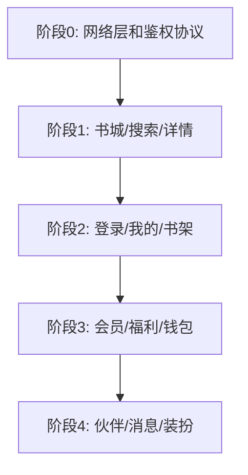

# 真实接口接入步骤建议

本文给前端和后端协作接入真实数据的执行顺序。建议先小范围跑通一条链路，再逐步替换 mock。

## 总原则

1. 先接读接口，再接写接口。
2. 先接不依赖登录的内容接口，再接用户态接口。
3. 保持前端页面层不动，优先替换 data 层。
4. mock 数据源保留，方便设计预览和接口异常时对比。
5. 每接一个模块都要有降级策略：加载中、空状态、错误状态。

## 阶段 0：接口约定和基础网络层

目标：先把全局调用方式定下来。

前端要做：

- 新增统一 HTTP client，集中处理：
  - `baseUrl`
  - headers
  - access token
  - 超时
  - JSON 解析
  - 业务错误码
- 确定环境切换：
  - mock
  - staging
  - production
- 保留 `SKIP_AUTH=true` 作为预览调试开关。

后端要确认：

- 响应包裹格式
- 错误码规范
- 分页规范
- 图片 URL 策略
- token 过期和刷新策略

建议新增前端文件：

```text
lib/core/network/api_client.dart
lib/core/network/api_exception.dart
lib/core/network/api_config.dart
```

## 阶段 1：内容读接口

优先接不依赖用户身份的内容页，让产品先能看到真实书籍内容。

### 1.1 书城首页

前端替换点：

```text
features/bookstore/data/datasources/bookstore_api_datasource.dart
features/bookstore/data/repositories/bookstore_repository_impl.dart
```

接口：

- `GET /bookstore/home`
- `GET /bookstore/guess-like`
- `GET /rankings`

验收：

- 书城首屏能展示真实推荐和榜单。
- 猜你喜欢能分页加载。
- 封面图从 URL 加载。

### 1.2 搜索

前端替换点：

```text
features/search/data/datasources/search_api_datasource.dart
features/search/data/repositories/search_repository_impl.dart
```

接口：

- `GET /search/hot-keywords`
- `GET /search/suggestions?q=`
- `GET /search?q=`
- `GET /search/recommendations`

验收：

- 输入关键词有联想。
- 搜索结果和空状态正确。
- 默认推荐和热搜词真实返回。

### 1.3 书籍详情

前端替换点：

```text
features/book_detail/data/datasources/book_detail_api_datasource.dart
features/book_detail/data/repositories/book_detail_repository_impl.dart
```

接口：

- `GET /books/{bookId}`
- `GET /books/{bookId}/comments`

验收：

- 从书城/搜索/书架进入详情都能按 `bookId` 展示真实详情。
- 目录、讨论、推荐能显示。
- 加载失败能展示错误态。

## 阶段 2：登录和用户态

目标：让用户资料、书架、资产开始真实。

### 2.1 登录

前端替换点：

```text
core/services/rest_auth_service.dart
core/services/auth_session_service.dart
core/services/service_locator.dart
```

接口：

- `POST /auth/sms/send`
- `POST /auth/sms/login`
- `POST /auth/carrier/login`
- `POST /auth/logout`
- `GET /me`

验收：

- 登录成功后保存 token。
- 重启 App 后能恢复会话。
- token 失效时能回到登录页。

### 2.2 我的页 / 账号设置

前端替换点：

```text
features/profile/data/datasources/profile_api_datasource.dart
features/account_settings/data/datasources/account_settings_api_datasource.dart
```

接口：

- `GET /me/profile-page`
- `GET /me`
- `PATCH /me/profile`

验收：

- 昵称、头像、资产、VIP 状态真实。
- 修改昵称后我的页同步刷新。

### 2.3 书架

前端替换点：

```text
features/bookshelf/data/datasources/bookshelf_api_datasource.dart
core/services/bookshelf_membership_service.dart
```

接口：

- `GET /me/bookshelf`
- `POST /me/bookshelf/{bookId}`
- `DELETE /me/bookshelf/{bookId}`
- `GET /me/reading-history`

验收：

- 加入/移除书架后各入口状态一致。
- 书架和阅读历史返回用户真实数据。

## 阶段 3：商业化和福利

目标：接入会员、充值、签到、任务、钱包流水。

### 3.1 会员

前端替换点：

```text
features/membership/data/datasources/membership_api_datasource.dart
core/services/membership_status_service.dart
```

接口：

- `GET /membership/page`
- `POST /membership/activate`
- `GET /me/membership`

验收：

- 会员状态跨我的页、福利页、会员页一致。
- 开通后权益状态更新。

### 3.2 福利

前端替换点：

```text
features/welfare/data/datasources/welfare_api_datasource.dart
```

接口：

- `GET /welfare/page`
- `POST /welfare/check-in`
- `POST /welfare/tasks/{taskId}/claim`

验收：

- 签到一天只能成功一次。
- 奖励数量和资产余额同步。
- 任务状态真实更新。

### 3.3 钱包

前端替换点：

```text
features/currency_wallet/data/datasources/currency_wallet_api_datasource.dart
features/currency_wallet/data/datasources/energy_records_api_datasource.dart
```

接口：

- `GET /me/currencies`
- `GET /me/currencies/{type}/wallet`
- `GET /me/currencies/{type}/records`
- `POST /orders/recharge`
- `POST /me/stardust/exchange`

验收：

- 余额、流水、充值档位真实。
- 充值/兑换后余额刷新。

## 阶段 4：互动业务

目标：接入伙伴、消息、装扮、评论等动态交互。

### 4.1 伙伴

前端替换点：

```text
features/partner/data/datasources/partner_api_datasource.dart
```

接口：

- `GET /partner/page`
- `GET /partner/characters`
- `GET /partner/conversations`
- `GET /partner/interaction-scenes`

验收：

- 探索、消息、互动三个 Tab 数据真实。
- 筛选、排序、分页由接口支持。
- 未读数和消息状态真实。

### 4.2 我的消息

前端替换点：

```text
features/my_messages/data/datasources/my_messages_api_datasource.dart
```

接口：

- `GET /me/messages`
- `GET /me/messages/unread-counts`
- `POST /me/messages/{id}/read`

验收：

- 回复、获赞、通知分别分页。
- 未读数准确。
- 进入对应 Tab 后能标记已读。

### 4.3 装扮 / 卡包

前端替换点：

```text
features/dress_up/data/datasources/dress_up_api_datasource.dart
```

接口：

- `GET /dress-up/page`
- `POST /dress-up/{itemId}/equip`
- `POST /dress-up/{itemId}/buy`
- `GET /me/card-pack`

验收：

- 已拥有/未拥有/当前穿戴状态真实。
- 购买或穿戴后状态刷新。

## 前后端协作建议

### 每个接口对齐这 5 件事

1. 页面截图或入口。
2. 请求参数。
3. 响应 JSON 示例。
4. 空状态和错误状态。
5. 分页或刷新策略。

### 前端自测建议

每接一个模块，至少验证：

- 首屏 loading。
- 请求成功。
- 请求失败。
- 空列表。
- 图片 URL 失败。
- 分页到底。
- 登录过期。

### 推荐交付顺序



## 给后端的最小首批清单

如果后端时间紧，建议第一周只交付这些接口：

1. `GET /bookstore/home`
2. `GET /search?q=`
3. `GET /search/suggestions?q=`
4. `GET /books/{bookId}`
5. `POST /auth/sms/send`
6. `POST /auth/sms/login`
7. `GET /me`

这 7 个接口可以让 App 从“静态 UI 预览”进入“真实内容 + 用户登录”的最小闭环。

